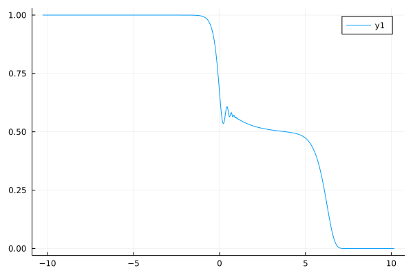

# ModeCouplingTheory.jl
[](https://github.com/IlianPihlajamaa/ModeCouplingTheory.jl/actions)
[](http://codecov.io/github/IlianPihlajamaa/ModeCouplingTheory.jl?branch=main)
<!--- [](https://IlianPihlajamaa.github.io/ModeCouplingTheory.jl/stable)-->
[](https://IlianPihlajamaa.github.io/ModeCouplingTheory.jl/dev)

A generic and fast solver of mode-coupling theory-like integrodifferential equations. It uses the algorithm outlined in [Fuchs et al.](https://iopscience.iop.org/article/10.1088/0953-8984/3/26/022/meta) to solve equations of the form
$$\alpha \ddot{F}(t) + \beta \dot{F}(t) + \gamma F(t) + \int_0^t d\tau K(t-\tau)\dot{F}(\tau) = 0, $$
in which $\alpha$, $\beta$, and $\gamma$ are coefficients, and $K(t) = K(F(t), t)$ is a memory kernel that may depend on $F$. This package exports some commonly used memory kernels, but it is straightforward to define your own. The solver is differentiable and works for scalar- and vector-valued functions $F(t)$. For more information see the [Documentation](https://IlianPihlajamaa.github.io/ModeCouplingTheory.jl/dev).


# Example usage:

We can define one of the predefined memory kernels 

```julia
julia> using ModeCouplingTheory
julia> λ = 3.999
3.999

julia> kernel = SchematicF2Kernel(λ)
SchematicF2Kernel{Float64}(3.999)
```
This kernel evaluates $K(t)=\lambda F(t)^2$.

We can now define the equation we want to solve as follows:

```
julia> α = 1.0; β = 0.0; γ = 2.0; F0 = 1.0; ∂F0 = 0.0;
julia> problem = MCTProblem(α, β, γ, F0, ∂F0, kernel);
```
and a solver:

```julia
julia> solver = FuchsSolver(problem)
```

Now we can solve the equation by calling `solve`:

```julia
julia> using Plots
julia> t, F, K = solve(problem, solver, kernel);
julia> plot(log10.(t), F)
```

Full copy-pastable example:

```julia
using ModeCouplingTheory, Plots
λ = 3.999
α = 1.0; β = 0.0; γ = 1.0; F0 = 1.0; ∂F0 = 0.0;
kernel = SchematicF2Kernel(λ)
problem = MCTProblem(α, β, γ, F0, ∂F0, kernel);
solver = FuchsSolver(problem);
t, F, K = solve(problem, solver, kernel);
plot(log10.(t), F)
```



Please open an issue if anything is unclear in the documentation, if any unexpected errors arise or for feature requests (such as additional kernels). PRs are of course also welcome.
