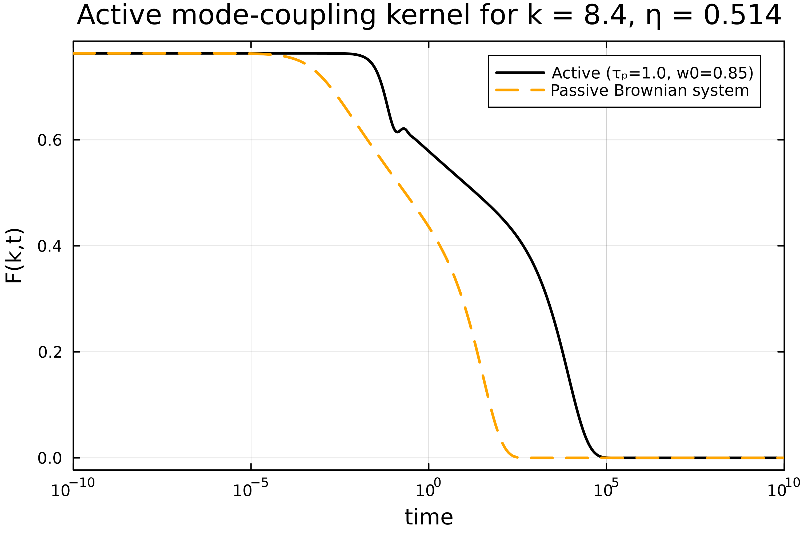

## Active Mode-Coupling Theory

### Single-component active MCT

Next to standard Mode-Coupling Theory, we also implemented a Mode-Coupling Theory for self-propelled (active) particles as derived in [1,2]. The equation of motion is slightly different than for passive Mode-Coupling Theory:

$$\ddot{F}(k,t) + \frac{1}{\tau_p}\dot{F}(k,t) + \frac{\omega(k) k^2}{S(k)}F(k,t) + \int_0^t \text{d}t' M(k,t-t') \dot{F}(k,t') = 0.$$

Here $\tau_p$ is the persistence time of a single active particle, and $\omega(k)$ represents equal-time velocity correlations, as introduced in [1]. The memory kernel $M(k,t)$ is given by

$$M(k,t) = \frac{\rho \omega(k)}{2 (2\pi)^d} \int \text{d}\mathbf{q} V(k,q)^2 F(q,t) F(|\mathbf{k}-\mathbf{q}|,t).$$

We also need modified expressions for the vertices $V(k,q)$ and direct correlation function $\mathcal{C}(k)$:

$$V(k,q) = \frac{\mathbf{k}\cdot\mathbf{q}}{k} \mathcal{C}(q) + \frac{\mathbf{k}\cdot(\mathbf{k}-\mathbf{q})}{k} \mathcal{C}(|\mathbf{k}-\mathbf{q}|)$$

$$\rho \mathcal{C}(k) = 1 - \frac{\omega(k)}{w(\infty) S(k)}$$

This version of active MCT requires extra input in the form of velocity correlations. It can be used for systems of active Brownian particles or active Ornstein-Uhlenbeck particles.

The kernel is discretized with the same method as described in `MCT.md`. It is not implemented according to Bengtzelius' trick, as we are mostly interested in two-dimensional applications where this trick is not applicable. The dimensionality of the kernel can be chosen with the parameter `dim` (the default is `dim=3`).

### Example code
```julia
using ModeCouplingTheory, Plots

Nk = 50; kmax = 40; dk = kmax / Nk;
k_array = dk*(collect(1:Nk) .- 0.5);

η = 0.514;
ρ = η*6/π;
τₚ = 1.0;   # persistence time

# use analytical functions as example data (as used in MCT.md)
function find_analytical_C_k(k, η)
    A = -(1 - η)^-4 *(1 + 2η)^2
    B = (1 - η)^-4*  6η*(1 + η/2)^2
    D = -(1 - η)^-4 * 1/2 * η*(1 + 2η)^2
    Cₖ = @. 4π/k^6 * 
    (
        24*D - 2*B * k^2 - (24*D - 2 * (B + 6*D) * k^2 + (A + B + D) * k^4) * cos(k)
     + k * (-24*D + (A + 2*B + 4*D) * k^2) * sin(k)
    )
    return Cₖ
end

function find_analytical_S_k(k, η)
        Cₖ = find_analytical_C_k(k, η)
        ρ = 6/π * η
        Sₖ = @. 1 + ρ*Cₖ / (1 - ρ*Cₖ)
    return Sₖ
end

# there is no analytical expression for w(k), so we use an example function
# (w(k) is usually obtained from simulation data)
approx_wk(x) = @. 0.8*(1 + cos(1.5*x)*exp(-0.2*x));
wk = approx_wk(k_array); w0=0.85;
Sk = find_analytical_S_k(k_array, η);

# memory equation coefficients
α = 1.0;
β = 1/τₚ;
γ = @. k_array^2 * wk / Sk;
γp = @. k_array^2 * 1.0 / Sk; 
δ = 0.0;

kernelA = ActiveMCTKernel(ρ, k_array, wk, w0, Sk, 3);
problemA = MemoryEquation(α, β, γ, δ, Sk, zeros(Nk), kernelA);
solA = solve(problemA);

# passive system for reference
kernelP = ModeCouplingKernel(ρ, 1.0, 1.0, k_array, Sk);
problemP = MemoryEquation(0.0, 1.0, γp, δ, Sk, zeros(Nk), kernelP);
solP = solve(problemP);

n = 11;
t = get_t(solA);
Fa = get_F(solA,:,n);
Fp = get_F(solP,:,n);

plot(t, Fa, xaxis=(:log10, [10^-4, :auto]), dpi=500, lc=:black, lw=2, labels="Active (τₚ=$(τₚ), w0=$(w0))", framestyle=:box)
plot!(t, Fp, lc=:orange, lw=2, ls=:dash, dpi=500, labels="Passive Brownian system")
xlabel!("time")
ylabel!("F(k,t)")
xlims!((1e-10,1e10))
title!("Active mode-coupling kernel for k = $(k_array[n]), η = $(η)")
```



### Tagged-particle kernel

- equations (Szamel appendix A)
- example code


### Multi-component

- multi-component equations

$$ \ddot{F}^{\alpha\beta}_k(t) + \frac{1}{\tau_p}\dot{F}^{\alpha\beta}_k(t) + \sum_{\gamma\delta} k^2 w^{\alpha\gamma}_k \left( S^{-1}_k \right)^{\gamma\delta} F^{\delta\beta}_k(t) + \sum_\gamma \int_0^t \text{d}t'\ M^{\alpha\gamma}_k(t-t') \dot{F}^{\gamma\beta}_k(t') = 0 $$

$$
M^{\alpha\beta}_k(t) = \frac{\rho}{2 (2\pi)^d} \sum_{\substack{\mu\, \nu \\ \mu'\nu'}}\sum_{\lambda} \int \text{d}\mathbf{q}\ w^{\alpha\gamma}_k V^{\mu\nu\gamma}_{k,q} V^{\mu'\nu'\beta}_{k,q} F^{\mu\mu'}_q(t) F^{\nu\nu'}_{|\mathbf{k}-\mathbf{q}|}(t).
$$

The multicomponent vertices are defined as

$$
V^{\mu\nu\alpha}_{k,q}= \frac{1}{\sqrt{x_\alpha}} \left( \frac{\mathbf{k}\cdot\mathbf{q}}{k} \delta^{\alpha\nu} \mathcal{C}_q^{\alpha\mu} + \frac{\mathbf{k}\cdot(\mathbf{k}-\mathbf{q})}{k} \delta^{\alpha\mu} \mathcal{C}_q^{\alpha\nu} \right),
$$

where $x_\alpha$ is the fraction of particles of species $\alpha$. The modified direct correlation function is defined as 

$$
\rho \mathcal{C}_q^{\alpha\beta} = \delta^{\alpha\beta} - \sum_{\gamma\sigma} (w_\infty^{-1})^{\alpha\gamma} w_q^{\gamma\sigma} (S_q^{-1})^{\sigma\beta}
$$

- note on implementation (why not Bengtzelius? performance?)
- example code


## References

[1] G. Szamel (2016). “Theory for the dynamics of dense systems of athermal self-propelled particles,” Phys. Rev. E, vol. 93, p. 012603. http://dx.doi.org/10.1103/PhysRevE.93.012603.

[2] V. Debets and L. M. C. Janssen (2023). “Mode-coupling theory for mixtures of athermal self-propelled particles,” J. Chem. Phys., vol. 159, p. 014502 https://doi.org/10.1063/5.0155142.
