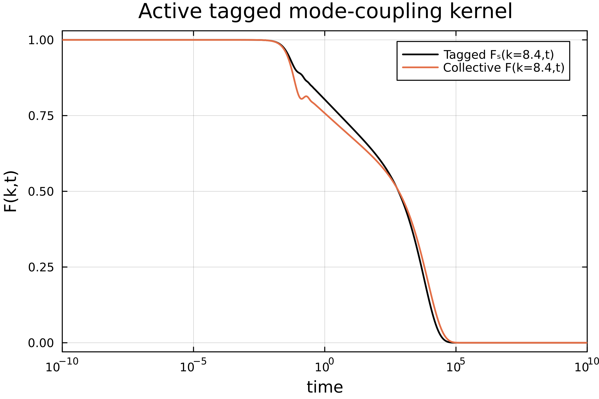
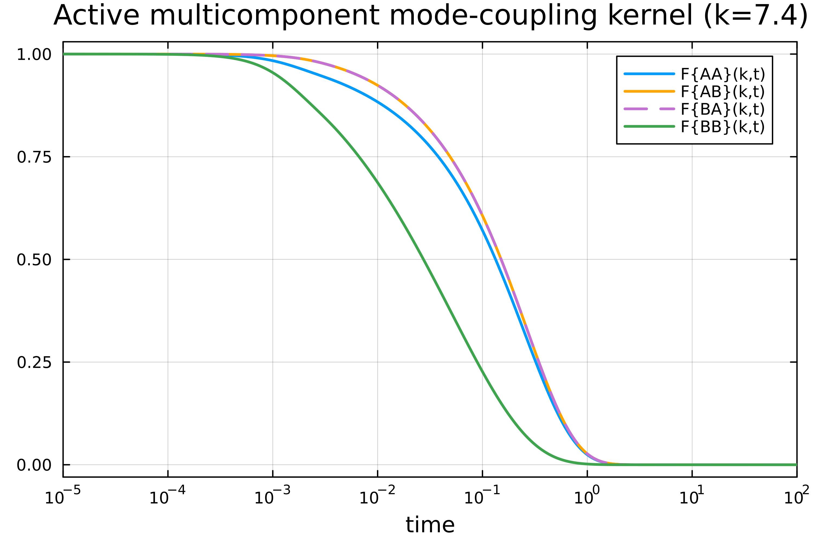

## Single-component active MCT

Next to standard mode-coupling theory (MCT), we also implemented a mode-coupling theory for athermal self-propelled (active) particles as derived in [1][2]. Athermal means that there is no thermal motion. The equation we need to solve is slightly different than for passive mode-coupling theory:

$$\ddot{F}(k,t) + \frac{1}{\tau_p}\dot{F}(k,t) + \frac{\omega(k) k^2}{S(k)}F(k,t) + \int_0^t \text{d}t'\ M(k,t-t') \dot{F}(k,t') = 0.$$

Here, $\tau_p$ is the persistence time of a single active particle. Active MCT requires extra input in the form of spatial velocity correlations $\omega(k)$ and their infinite-wavelength limit $\omega(\infty)$. Since the effect of active forces is encoded in $S(k)$, $\omega(k)$ and $\omega(\infty)$, the theory can be directly applied to different systems, such as active Brownian particles or active Ornstein-Uhlenbeck particles.

The memory kernel $M(k,t)$ in $d$ dimensions is given by

$$M(k,t) = \frac{\rho\, \omega(k)}{2 (2\pi)^d} \int \text{d}\mathbf{q}\ V(\mathbf{k},\mathbf{q})^2 F(q,t) F(|\mathbf{k}-\mathbf{q}|,t).$$

We also need (modified) expressions for the vertices $V(\mathbf{k},\mathbf{q})$ and direct correlation function $\mathcal{C}(k)$:

$$V(\mathbf{k},\mathbf{q}) = \frac{\mathbf{k}\cdot\mathbf{q}}{k} \mathcal{C}(q) + \frac{\mathbf{k}\cdot(\mathbf{k}-\mathbf{q})}{k} \mathcal{C}(|\mathbf{k}-\mathbf{q}|)$$

$$\rho \mathcal{C}(k) = 1 - \frac{\omega(k)}{w(\infty) S(k)}$$

The discretization of the kernel is described on the page "Mode-Coupling Theory". The kernel is not implemented using Bengtzelius' trick, as we are mostly interested in two-dimensional applications where this is not applicable. The dimensionality of the kernel can be chosen with the parameter `dim` (the default is `dim=3`). Already implemented functionalities from standard MCT were re-used so any dimension up to $d \approx 20$ should be supported, although we only explicitly tested `dim=2` and `dim=3` for this kernel.

### Example code single-component
```julia
using ModeCouplingTheory, Plots

Nk = 50; kmax = 40; dk = kmax / Nk;
k_array = dk*(collect(1:Nk) .- 0.5);

η = 0.514;  # packing fraction
ρ = η*6/π;  # number density
τₚ = 1.0;   # persistence time

# use analytical functions as example data (as defined in "Mode-Coupling Theory")
function find_analytical_C_k(k, η)
    A = -(1 - η)^-4 *(1 + 2η)^2
    B = (1 - η)^-4*  6η*(1 + η/2)^2
    D = -(1 - η)^-4 * 1/2 * η*(1 + 2η)^2
    Cₖ = @. 4π/k^6 * 
    (
        24*D - 2*B * k^2 - (24*D - 2 * (B + 6*D) * k^2 + (A + B + D) * k^4) * cos(k)
     + k * (-24*D + (A + 2*B + 4*D) * k^2) * sin(k)
    )
    return Cₖ
end

function find_analytical_S_k(k, η)
        Cₖ = find_analytical_C_k(k, η)
        ρ = 6/π * η
        Sₖ = @. 1 + ρ*Cₖ / (1 - ρ*Cₖ)
    return Sₖ
end

# there is no analytical expression for w(k), so we use an example function
# (w(k) is usually obtained from simulation data)
approx_wk(x) = @. 0.8*(1 + cos(1.5*x)*exp(-0.2*x));
wk = approx_wk(k_array);
w0=0.85;
Sk = find_analytical_S_k(k_array, η);

# memory equation coefficients
α = 1.0; β = 1/τₚ; δ = 0.0;
γ = @. k_array^2 * wk / Sk;
γp = @. k_array^2 * 1.0 / Sk; 

kernelA  = ActiveMCTKernel(ρ, k_array, wk, w0, Sk, 3);
problemA = MemoryEquation(α, β, γ, δ, Sk, zeros(Nk), kernelA);
solA     = solve(problemA);

# passive system for reference
kernelP  = ModeCouplingKernel(ρ, 1.0, 1.0, k_array, Sk);
problemP = MemoryEquation(0.0, 1.0, γp, δ, Sk, zeros(Nk), kernelP);
solP     = solve(problemP);

n  = 11;
t  = get_t(solA);
Fa = get_F(solA,:,n);
Fp = get_F(solP,:,n);

plot(t, Fa, xaxis=(:log10, [10^-4, :auto]), dpi=500, lc=:black, lw=2, labels="Active (τₚ=$(τₚ), w0=$(w0))", framestyle=:box)
plot!(t, Fp, lc=:orange, lw=2, ls=:dash, dpi=500, labels="Passive Brownian system")
xlabel!("time")
ylabel!("F(k,t)")
xlims!((1e-10,1e10))
title!("Active mode-coupling kernel for k = $(k_array[n]), η = $(η)")
```


## Tagged-particle kernel

The dynamics of a tagged active particle is governed by the following equation [1]:

$$
\ddot{F}_s(k,t) + \frac{1}{\tau_p} \dot{F}_s(k,t) + w(\infty) k^2 F_s(k,t) + \int_0^t \text{d}t'\ M_s(k,t-t') \dot{F}_s(k,t') = 0,
$$

where $F_s(k,t)$ is the self-intermediate scattering function. The memory kernel is given by

$$
M_s(k,t) = \frac{\rho\, w(\infty)}{(2\pi)^d} \int \text{d}\mathbf{q}\ \left( \frac{\mathbf{k}\cdot(\mathbf{k} - \mathbf{q})}{k} \right)^2 F_s(q,t) F(|\mathbf{k}-\mathbf{q}|,t).
$$

The tagged-particle memory kernel requires the collective intermediate scattering function $F(k,t)$ as input. An example implementation of the tagged active memory kernel is given below.

### Example code tagged-particle kernel

```julia
# run the code from the single-component active MCT example for the constants and input data

kernelA  = ActiveMCTKernel(ρ, k_array, wk, w0, Sk, 3);
problemA = MemoryEquation(α, β, γ, δ, Sk, zeros(Nk), kernelA);
solA     = solve(problemA);

# α, β and δ are the same, but γ is different for a tagged particle
γT = @. k_array^2 * w0 / Sk;

kernelT  = TaggedActiveMCTKernel(ρ, k_array, wk, w0, Sk, solA, 3);
problemT = MemoryEquation(α, β, γT, δ, ones(Nk), zeros(Nk), kernelT);
solT     = solve(problemT);

n  = 11;
t  = get_t(solA);
Fc = get_F(solA,:,n);
Ft = get_F(solT,:,n);

plot(t, Ft, xaxis=(:log10), dpi=500, lc=:black, lw=1.7, labels="Tagged Fₛ(k=8.4,t)", framestyle=:box)
plot!(t, Fc/Sk[n], labels="Collective F(k=8.4,t)", lw=1.7)
xlabel!("time")
ylabel!("F(k,t)")
xlims!((1e-10,1e10))
title!("Active tagged mode-coupling kernel")
```



## Multi-component active MCT

Active mode-coupling theory can also be solved for mixtures of particles. The multi-component equation reads [2]

$$ \ddot{F}^{\alpha\beta}_k(t) + \frac{1}{\tau_p}\dot{F}^{\alpha\beta}_k(t) + \sum_{\gamma\delta} k^2 \omega^{\alpha\gamma}_k \left( S^{-1}_k \right)^{\gamma\delta} F^{\delta\beta}_k(t) + \sum_\gamma \int_0^t \text{d}t'\ M^{\alpha\gamma}_k(t-t') \dot{F}^{\gamma\beta}_k(t') = 0, $$

where Greek letters denote particle species. The input now consists of partial structure factors ( $S_k^{\alpha\beta}$ ) and partial velocity correlations ( $\omega_k^{\alpha\beta}$ and $\omega_\infty^{\alpha\beta}$ ). The multicomponent memory kernel can be written as

$$
M^{\alpha\beta}_k(t) = \frac{1}{2 (2\pi)^d} \sum_{\substack{\mu\, \nu \\ \mu'\nu'}}\sum_{\lambda} \int \text{d}\mathbf{q}\ F^{\mu\mu'}_q(t) F^{\nu\nu'}_{|\mathbf{k}-\mathbf{q}|}(t) V^{\mu\nu\alpha}_{\mathbf{k},\mathbf{q}} V^{\mu'\nu'\lambda}_{\mathbf{k},\mathbf{q}} (\omega^{-1}_k)^{\lambda\beta}.
$$

The multicomponent vertices are defined as

$$
V^{\mu\nu\alpha}_{\mathbf{k},\mathbf{q}}= \sum_{\gamma}\frac{\omega_k^{\alpha\gamma}}{\sqrt{\rho_\gamma}} \left( \frac{\mathbf{k}\cdot\mathbf{q}}{k} \delta_{\gamma\nu} \mathcal{C}_q^{\gamma\mu} + \frac{\mathbf{k}\cdot(\mathbf{k}-\mathbf{q})}{k} \delta_{\gamma\mu} \mathcal{C}^{\gamma\nu}_{|\mathbf{k}-\mathbf{q}|} \right),
$$

where $x_\alpha$ is the fraction of particles of species $\alpha$ and $\delta_{\alpha\beta}$ is a Kronecker delta. The modified direct correlation function is defined as 

$$
\mathcal{C}_q^{\alpha\beta} = \delta_{\alpha\beta} - \sum_{\gamma\sigma} (w_\infty^{-1})^{\alpha\gamma} w_q^{\gamma\sigma} (S_q^{-1})^{\sigma\beta}
$$

The multi-component kernel is not implemented using Bengtzelius' trick. Instead, we used the package Tullio to improve the performance of the active kernel. If you want to use an active kernel in odd dimensions greater than 3, you could consider implementing this trick (see also the passive multi-component MCT kernel) for better performance.

### Example code multi-component kernel

```julia
using ModeCouplingTheory, Plots, DelimitedFiles, StaticArrays

Ns = 2         # number of species          
Nk = 100       # number of k-values
kmax = 40.0; dk = kmax/Nk; k_array = dk*(collect(1:Nk) .- 0.5);

τₚ = 0.001      # persistence time
x = [0.8, 0.2]  # number fractions
ρ_all = 1.2     # (total) number density
ρₐ = ρ_all * x  # partial densities

# the input data can be found in the \test\ folder
Sk_file = readdlm("dataVincent_Sk_Teff4.0_tau0.001.txt", ';')
wk_file = readdlm("dataVincent_wk_Teff4.0_tau0.001.txt", ';')
w0 = SMatrix{Ns,Ns}(readdlm("dataVincent_w0_Teff4.0_tau0.001.txt",';'));

# rewrite data as a vector of Static Matrices for improved performance
Sk = [@SMatrix zeros(Ns, Ns) for i=1:Nk]
wk = [@SMatrix zeros(Ns, Ns) for i=1:Nk]

for i=1:Nk
    Sk[i] = Sk_file[i,:]
    wk[i] = wk_file[i,:]
end

# define mode-coupling parameters
α = 1.0; β = 1/τₚ;
δ = @SMatrix zeros(Ns, Ns)
γ = [@SMatrix zeros(Ns, Ns) for j in 1:length(k_array)]

for i=1:Nk
    γ[i] = k_array[i]^2 .* wk[i] * inv(Sk[i]);
end

kernel  = ActiveMultiComponentKernel(ρₐ, k_array, wk, w0, Sk, 3);
problem = MemoryEquation(α, β, γ, δ, Sk, 0.0.*similar(Sk), kernel);
solver  = TimeDoublingSolver(verbose=true, N=16, Δt = 10^(-6), tolerance=10^-8, max_iterations=10^8, t_max=10^5.0);
sol     = @time solve(problem, solver);

k_index = 19;
t = get_t(sol);
F_11 = get_F(sol, :, k_index, 1);
F_12 = get_F(sol, :, k_index, 2);
F_21 = get_F(sol, :, k_index, 3);
F_22 = get_F(sol, :, k_index, 4);

plot(t, F_11/Sk[k_index][1], xaxis=(:log10, [10^-5, 10^2]), dpi=500, lc=1, lw=2, labels="F{AA}(k,t)", framestyle=:box)
plot!(t, F_12/Sk[k_index][2], dpi=500, lc=:orange, lw=2, labels="F{AB}(k,t)")
plot!(t, F_21/Sk[k_index][3], dpi=500, lc=4, lw=2, ls=:dash, labels="F{BA}(k,t)")
plot!(t, F_22/Sk[k_index][4], dpi=500, lc=3, lw=2, labels="F{BB}(k,t)")
xlabel!("time")
title!("Active multicomponent mode-coupling kernel (k=7.4)")
```



## Note on input data

The input data (consisting of $S_k^{\alpha\beta}$ and $\omega_k^{\alpha\beta}$) is expected to be a vector of matrices, with the vector having length $N_k$ and the matrix having size $N_s$ x $N_s$.

Note that the multicomponent active MCT kernel has been implemented with the following convention for the partial structure factor and direct correlation function, **which is different** from the convention used for the passive kernels in this package:

$$ S_k^{\alpha\beta} = \frac{1}{\sqrt{N_\alpha N_\beta}} \sum_{i=1}^{N_\alpha} \sum_{j=1}^{N_\beta} \braket{ e^{i\mathbf{k}\cdot(\mathbf{r}_j^\beta - \mathbf{r}_i^\alpha)}} $$

$$ C_{k}^{\alpha\beta} = \delta_{\alpha\beta} - (S^{-1}_k)^{\alpha\beta} $$

The definitions used in the passive kernels are given in [3]. The structure factor can be converted to the right format by simply changing the (species-dependent) prefactor.


## References

[1] G. Szamel. *Theory for the dynamics of dense systems of athermal self-propelled particles*. Phys. Rev. E **93**, 012603 (2016).

[2] V.E. Debets and L.M.C. Janssen. *Mode-coupling theory for mixtures of athermal self-propelled particles*. J. Chem. Phys. **159**, 014502 (2023).

[3] F. Weysser et al. *Structural relaxation of polydisperse hard spheres: Comparison of the mode-coupling theory to a Langevin dynamics simulation*. Phys. Rev. E **82**, 011504 (2010).