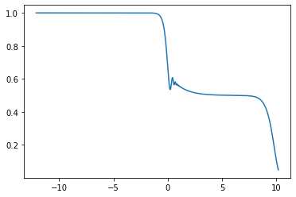

# Calling from Python

Using `ModeCouplingTheory` from Python can be useful for solving mode-coupling theory repeatedly or for large systems of equations, making the overhead of initializing Julia negligible. (Or perhaps if one prefers to work in Python.)

## Installing

First, install `julia` through the `pip` package manager, with

```bash
% pip install julia
```

Using `ipython3` (only Python $\geq$ 3 is supported), do:

```python
from julia import Main
```

which will install the latest stable version of Julia the first time it is called. Now install `ModeCouplingTheory.jl`, with

```python
from julia import Pkg
Pkg.add("ModeCouplingTheory")
```

To import this package in order to use it we need to run:

```python
from julia import ModeCouplingTheory as mct
```

## Usage

And now we can use ModeCouplingTheory.jl in Python:

```python
# since Python doesn't like all unicode symbols (α, β, ∂, ...), we use standard letters:
k = 3.99999
a = 1.0
b = 0.0
c = 1.0
d = 0.0
F0 = 1.0
dF0 = 0.0
kernel = mct.SchematicF2Kernel(k)
problem = mct.LinearMCTEquation(a, b, c, d, F0, dF0, kernel)
sol = mct.solve(problem)

import matplotlib.pyplot as plt
import numpy as np
plt.plot(np.log10(sol.t), sol.F)
plt.show()
```

et voilà!



See the documentation of [pyjulia](https://pyjulia.readthedocs.io/en/latest/usage.html) for more information on how to call julia from python.
