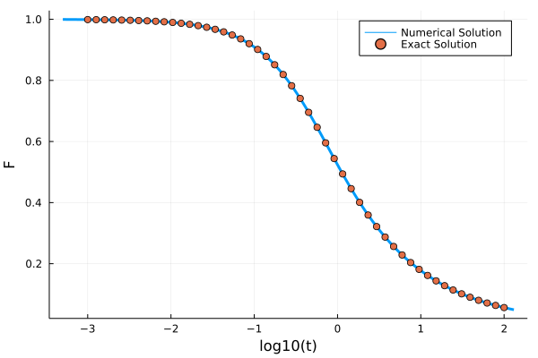
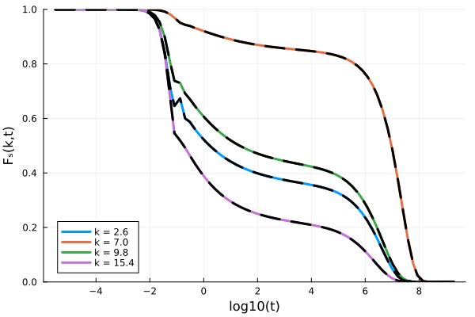
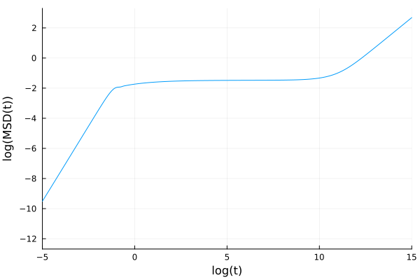
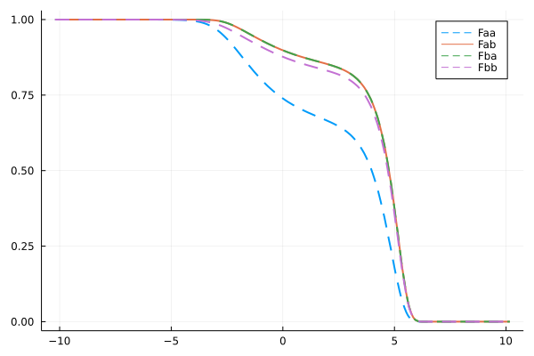
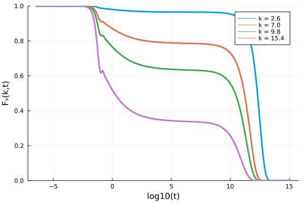

# Kernels

A memory kernel `kernel` is an instance of a type of which `MemoryKernel` is a supertype. It can be called like `out = evaluate_kernel(kernel, F, t)`. Additionally, when `F` is a mutable container like a `Vector`, it can be called like `evaluate_kernel!(out, kernel, F, t)` in which case it will mutate the elements of the temporary array `out`. Below we list the memory kernels that this package defines and give some examples of how to use them.

## Schematic Kernels

This package includes a couple of schematic memory kernels.

### 1. `ExponentiallyDecayingKernel`

The `ExponentiallyDecayingKernel` implements the kernel $K(t) = λ \exp(-t/τ)$. It has fields `λ <: Number` and `τ <: Number`.

#### Example

The integro-differential equation with this memory kernel actually has an analytic solution for $\tau=1$, $\alpha=0$ , $\beta=1$, and $\gamma=1$. It is given by

$$F(t) = \frac{e^{-\frac{t}{2}\left( \lambda + \sqrt{\lambda(\lambda+4)} + 2\right)}}{2 \sqrt{\lambda  (\lambda +4)}}\left(\sqrt{\lambda(\lambda+4)} \left(e^{\sqrt{\lambda(\lambda+4)} t}+1\right)+\lambda  \left(e^{\sqrt{\lambda(\lambda+4)} t}-1\right)\right)$$

```julia
F0 = 1.0; ∂F0 = 0.0; α = 0.0; β = 1.0; γ = 1.0; δ = 0.0; λ = 1.0; τ = 1.0;

kernel = ExponentiallyDecayingKernel(λ, τ)
problem = MemoryEquation(α, β, γ, δ, F0, ∂F0, kernel)
solver = TimeDoublingSolver(Δt=10^-3, t_max=10.0^2, verbose=false, N = 128, tolerance=10^-10, max_iterations=10^6)
sol =  solve(problem, solver)

t_analytic = 10 .^ range(-3, 2, length=50)
F_analytic = @. (exp(-0.5*(3+sqrt(5))* t_analytic)*(exp(sqrt(5)*t_analytic) * (1+sqrt(5))-1+sqrt(5)))/(2sqrt(5))

using Plots
p = plot(log10.(sol.t), sol.F, label="Numeric solution", lw=3)
scatter!(log10.(t_analytic), F_analytic, label="Exact solution", ylabel="F", xlabel="log10(t)")
```


### `SchematicF1Kernel`

The `SchematicF1Kernel` implements the kernel $K(t) = ν F(t)$. It has one field `ν <: Number`.

#### Example

The integro-differential equation with this memory kernel also has an analytic solution for $\alpha=0$ , $\beta=1$, and $\nu=1$. It is given by

$$F(t) =  e^{-2t}\left(I_0(2t) + I_1(2t) \right)$$

in which $I_k$ are modified Bessel functions of the first kind.
```julia
F0 = 1.0; ∂F0 = 0.0; α = 0.0; β = 1.0; γ = 1.0; ν = 1.0; δ = 0.0

kernel = SchematicF1Kernel(ν)
problem = MemoryEquation(α, β, γ, δ, F0, ∂F0, kernel)
solver = TimeDoublingSolver(Δt=10^-3, t_max=10.0^2, verbose=false, N = 100, tolerance=10^-14, max_iterations=10^6)
sol =  solve(problem, solver)

using Plots, SpecialFunctions
t_analytic = 10 .^ range(-3, 2, length=50)
F_analytic = @. exp(-2*t_analytic)*(besseli(0, 2t_analytic) + besseli(1, 2t_analytic))
plot(log10.(sol.t), sol.F, label="Numerical Solution", ylabel="F", xlabel="log10(t)", lw=3)
scatter!(log10.(t_analytic), F_analytic, label="Exact Solution")
```


### `SchematicF2Kernel`

The `SchematicF2Kernel` implements the kernel $K(t) = ν F(t)^2$. It has one field `ν <: Number`.

### `SchematicF123Kernel`

The `SchematicF123Kernel` implements the kernel $K(t) = \nu_1 F(t) + \nu_2 F(t)^2 + \nu_3 F(t)^3$. It has fields `ν1 <: Number`, `ν2 <: Number`, and `ν3 <: Number`.

#### Example
```julia
kernel = SchematicF123Kernel(3.0, 2.0, 1.0);
F = 2; t = 0;
evaluate_kernel(kernel, F, t) # returns 22.0 = 3*2^1 + 2*2^2 + 1*2^3
```

### `InterpolatingKernel`

The `InterpolatingKernel` implements a kernel that interpolates memory kernel data. It is initialized by calling `kernel = InterpolatingKernel(t, M, k=k)` where t is a `Vector` of time points, `M` is a vector of corresponding memory kernel values, and `k` is the integer degree of polynomial interpolation (default=1). This kernel is implemented using `Dierckx.Spline1D`. See [Dierckx.jl](https://github.com/kbarbary/Dierckx.jl) for more information.

### `SchematicDiagonalKernel`

The `SchematicDiagonalKernel` implements the kernel $K_{ij}(t) = \delta_{ij} \nu_i F_i(t)^2$. It has one field `ν` which must be either a `Vector` or an `SVector`. When called, it returns `Diagonal(ν .* F .^ 2)`, i.e., it implements a non-coupled system of `SchematicF2Kernels`.

### `SchematicMatrixKernel`

The `SchematicMatrixKernel` implements the kernel $K_{ij}(t) = \sum_k \nu_{ij} F_k(t) F_j(t)$. It has one field `ν` which must be either a `Matrix` or an `SMatrix`. 

### `SjogrenKernel`

The `SjogrenKernel` implements the kernel $K_{1}(t) = \nu_1 F_1(t)^2$, $K_{2}(t) = \nu_2 F_1(t) F_2(t)$. It has two fields `ν1` and `ν2` which must both be of the same type. Consider using Static Vectors for performance.

Example:

```julia
using StaticArrays
α = 1.0
β = 0.0
γ = 1.0
δ = 0.0
ν1 = 2.0
ν2 = 1.0
F0 = @SVector [1.0, 1.0]
∂F0 = @SVector [0.0, 0.0]
kernel = SjogrenKernel(ν1, ν2)
eq = MemoryEquation(α, β, γ, δ, F0, ∂F0, kernel)
sol = solve(eq)
```

### `TaggedSchematicF2Kernel`

The `TaggedSchematicF2Kernel` implements a memory kernel $K(t) = \nu F(t) F_c(t)$, where $F_c(t)$ is a correlator that the tagged one couples to. It must be a solution of an earlier schematic MCT equation. Make sure to use the same solver settings for both solves. 

Example:

```julia
F0 = 1.0
∂F0 = 0.0
α = 1.0
β = 0.0
γ = 1.0
δ = 0.0
ν1 = 2.0
ν2 = 1.0
kernel = SchematicF2Kernel(ν1)
eq = MemoryEquation(α, β, γ, δ, F0, ∂F0, kernel)
sol = solve(eq)

taggedkernel = TaggedSchematicF2Kernel(ν2, sol)
tagged_eq = MemoryEquation(α, β, γ, δ, F0, ∂F0, taggedkernel)
tagged_sol = solve(tagged_eq);
```

This example is (less performantly) equivalent to the example of the Sjogren kernel above. 

## Mode-Coupling Theory

The mode-coupling theory equation reads

$$\ddot{F}(k,t) + \Omega(k)F(k,t) + \int_0^td\tau K(t-\tau, k)\dot{F}(k,\tau)=0$$

in which $\Omega(k) = k^2 k_B T/mS(k)$, and

$$K(k,t) =\frac{\rho k_BT}{16\pi^3 m} \int d\mathbf{q} V(\mathbf{k}, \mathbf{q})^2F(q, t)F(|\mathbf{k}-\mathbf{q}|,t)$$

in which the vertex $V(\textbf{k}, \textbf{q}) = (\textbf{k}\cdot\textbf{q})c(q)/k+(\textbf{k}\cdot(\textbf{k}-\textbf{q})c(|\textbf{k}-\textbf{q}|)/k$. For more details and the meaning of the symbols, see [1, 2].

This memory kernel integral is discretised as follows:

$$\int d\textbf{q}f(q, |\textbf{k}-\textbf{q}|) = 2\pi\int_0^\infty dq q^2 \int_0^\pi d\theta \sin \theta f(q, |\textbf{k}-\textbf{q}|) = \frac{2\pi}{k}\int_0^\infty dq \int_{|k-q|}^{k+q}dp pq f(q, p) \approx \frac{2\pi \Delta k^2}{k_i}\sum_{j=1}^{N_k} \sum_{l=|j-i|+1}^{j+i-1} \frac{p_l q_j}{k_i}f(q_j, p_l).$$
 
in which $p = |\textbf{k}-\textbf{q}|$, and wave numbers $k$, $q$ and $p$ are discretized on the equidistant grid $k_i = (i_k-\frac{1}{2})\Delta k$ where $i_k = 1, 2, 3, \ldots, N_k$. The double sum is then performed for all $k$ using Bengtzelius' trick, yielding a fast $O(N_k^2)$ algorithm.

### Example 

```julia
"""
    find_analytical_C_k(k, η)
Finds the direct correlation function given by the 
analytical Percus-Yevick solution of the Ornstein-Zernike 
equation for hard spheres for a given volume fraction η.

Reference: Wertheim, M. S. "Exact solution of the Percus-Yevick integral equation 
for hard spheres." Physical Review Letters 10.8 (1963): 321.
""" 
function find_analytical_C_k(k, η)
    A = -(1 - η)^-4 *(1 + 2η)^2
    B = (1 - η)^-4*  6η*(1 + η/2)^2
    D = -(1 - η)^-4 * 1/2 * η*(1 + 2η)^2
    Cₖ = @. 4π/k^6 * 
    (
        24*D - 2*B * k^2 - (24*D - 2 * (B + 6*D) * k^2 + (A + B + D) * k^4) * cos(k)
     + k * (-24*D + (A + 2*B + 4*D) * k^2) * sin(k)
     )
    return Cₖ
end

"""
    find_analytical_S_k(k, η)
Finds the static structure factor given by the 
analytical Percus-Yevick solution of the Ornstein-Zernike 
equation for hard spheres for a given volume fraction η.
""" 
function find_analytical_S_k(k, η)
        Cₖ = find_analytical_C_k(k, η)
        ρ = 6/π * η
        Sₖ = @. 1 + ρ*Cₖ / (1 - ρ*Cₖ)
    return Sₖ
end

# We solve MCT for hard spheres at a volume fraction of 0.51591
η = 0.51591; ρ = η*6/π; kBT = 1.0; m = 1.0

Nk = 100; kmax = 40.0; dk = kmax/Nk; k_array = dk*(collect(1:Nk) .- 0.5)
Sₖ = find_analytical_S_k(k_array, η)

∂F0 = zeros(Nk); α = 1.0; β = 0.0; γ = @. k_array^2*kBT/(m*Sₖ); δ = 0.0

kernel = ModeCouplingKernel(ρ, kBT, m, k_array, Sₖ)
problem = MemoryEquation(α, β, γ, δ, Sₖ, ∂F0, kernel)
solver = TimeDoublingSolver(Δt=10^-5, t_max=10.0^15, verbose=false, 
                     N = 8, tolerance=10^-8)
sol = @time solve(problem, solver);
    # 3.190870 seconds (377.93 k allocations: 106.456 MiB, 0.42% gc time)
p = plot(xlabel="log10(t)", ylabel="F(k,t)", ylims=(0,1))
for ik = [7, 18, 25, 39]
    plot!(p, log10.(sol.t), sol[ik]/Sₖ[ik], label="k = $(k_array[ik])", lw=3)
end
p
```



#### References
[1] Reichman, David R., and Patrick Charbonneau. "Mode-coupling theory." Journal of Statistical Mechanics: Theory and Experiment 2005.05 (2005): P05013.

[2] Janssen, Liesbeth MC. "Mode-coupling theory of the glass transition: A primer." Frontiers in Physics 6 (2018): 97.

### TaggedModeCouplingKernel

Let's say we have just solved the mode-coupling equations, and we now want to include also a tagged particle solution (to find the self-intermediate scattering function). This function satisfies

$$\ddot{F}_s(k,t) + \frac{k^2 k_BT}{m} F_s(k,t) + \int_0^t d\tau K(k, t-\tau)\dot{F}_s(k, \tau)=0,$$

in which

$$K(k,t) = \frac{\rho k_BT}{8\pi^3 m}\int d\mathbf{q} V(\mathbf{k}, \mathbf{q})^2 F(q, t)F_s(|\mathbf{k}-\mathbf{q}|,t)$$
 
where

$V(\textbf{k}, \textbf{q}) = (\textbf{k}\cdot\textbf{q})c(q)/k = \frac{k^2+q^2-p^2}{2k} \cdot c(q),$
are the tagged vertices. This is done using the `TaggedModeCouplingKernel`.

Example (excluding the code from collective MCT):
```julia
taggedF0 = ones(Nk); tagged∂F0 = zeros(Nk); α = 1.0; β = 0.0; γ = @. k_array^2*kBT/m; δ = 0.0

taggedkernel = TaggedModeCouplingKernel(ρ, kBT, m, k_array, Sₖ, sol)
taggedequation = MemoryEquation(α, β, γ, δ, taggedF0, tagged∂F0, taggedkernel)
taggedsol = solve(taggedequation, solver)
```

### Mean squared displacement (MSD)

From the tagged particle dynamics we just computed, we can evaluate the MSD, as a low k limit. The equations that it satisfies are

$$\ddot{\delta r^2}(t) - \frac{6 k_BT}{m}  + \int_0^t d\tau K(k, t-\tau)\delta\dot{ r}^2(\tau)=0,$$

where

$$K(t) = \frac{\rho k_BT}{6\pi^2 m}\int_0^\infty dq q^4c(q)^2F(q,t)F_s(q,t).$$
This kernel is implemented in the `MSDModeCouplingKernel`

Example:

```julia
MSD0 = 0.0; dMSD0 = 0.0; α = 1.0; β = 0.0; γ = 0.0; δ = -6.0*kBT/m;
msdkernel = MSDModeCouplingKernel(ρ, kBT, m, k_array, Sₖ, sol, taggedsol)
msdequation = MemoryEquation(α, β, γ, δ, MSD0, dMSD0, msdkernel)
msdsol = solve(msdequation, solver)

plot(log10.(msdsol.t), log10.(msdsol.F), xlabel="log(t)", ylabel="log(MSD(t))", xlims=(-5,15), label=false)
```


## Multi-component Mode-Coupling Theory

The multi-component mode-coupling theory equation reads

$$\ddot{F}_{\alpha\beta}(k,t) + \Omega^2_{\alpha\gamma}(k)F_{\gamma\beta}(k,t) + \int_0^td\tau K_{\alpha\gamma}(t-\tau, k)\dot{F}_{\gamma\beta}(k, \tau)=0$$

in which $\Omega^2_{\alpha\gamma} = k^2 k_B T x_\alpha/m_\alpha \cdot \left(S^{-1}\right)_{\alpha\gamma}(k)$, and $(\textbf{S})^{-1}(k) = (\frac{\delta_{\alpha\beta}}{x_\alpha} - \rho c_{\alpha\gamma}(k))$. The memory kernel is given by

$$K_{\alpha\beta}(k,t) =\frac{k_B T \rho}{2 x_\beta m_\alpha (2\pi)^3} \int d\mathbf{q} V_{\mu'\nu'\alpha}(\mathbf{k}, \mathbf{q})F_{\mu\mu'}(q, t)F_{\nu\nu'}(|\mathbf{k}-\mathbf{q}|,t)V_{\mu\nu\beta}(\mathbf{k}, \mathbf{q})$$

in which the vertex $V_{\mu\nu\alpha}(\mathbf{k}, \mathbf{q}) = (\textbf{k}\cdot\textbf{q})c_{\alpha\mu}(q)\delta_{\alpha\nu}/k+(\textbf{k}\cdot(\textbf{k}-\textbf{q})c_{\alpha\nu}(|\textbf{k}-\textbf{q}|)\delta_{\alpha\mu}/k$. Here, the Greek indices indicate species labels, and we have adopted the convention that we sum over repeated indices. This memory kernel has also been implemented using the Bengtzelius' trick. It requires $O(N_k^2 N_s^2)$ storage and runs in $O(N_k^2 N_s^4)$ in which $N_s$ is the number of species.

Numerically, the correlator $F_{\alpha\beta}(k)$ is implemented as a `Vector` of length `Nk` of which each of the elements is a small `Ns` x `Ns` static matrix. This means that this is also the expected form of the initial condition. If, instead you have the data in a matrix format where each element of the matrix is a list of k-vales, use the `convert_multicomponent_structure_factor(S)` function to convert it into the right format, see the API page. All symbols have the same meaning as those presented in "Weysser, F., Puertas, A. M., Fuchs, M., & Voigtmann, T. (2010). Structural relaxation of polydisperse hard spheres: Comparison of the mode-coupling theory to a Langevin dynamics simulation. Physical review E, 82(1), 011504."

### Example

```julia
using StaticArrays, LinearAlgebra, DelimitedFiles
# number of species Ns, number of wave numbers Nk, volume fraction η
# thermal energy kBT and mass m
Ns = 2; Nk = 100; η  = 0.515; kBT = 1.0; m = ones(Ns)
particle_diameters = [0.8,1.0]
x = [0.2,0.8] # concentration fraction

# total density
ρ_all = 6η/(π*sum(x .* particle_diameters .^3))
ρ = ρ_all * x

kmax = 40.0; dk = kmax/Nk
k_array = dk*(collect(1:Nk) .- 0.5)

# data can be found in the \test\ folder of the source code
Sₖdata = reshape(readdlm("test/Sk_MC.txt"), (2,2,100))
# convert the data to the Vector of SMatrix format
Sₖ = [@SMatrix(zeros(Ns, Ns)) for i = 1:Nk]
for i = 1:Nk
    Sₖ[i] = Sₖdata[:, :, i]
end
S⁻¹ = inv.(Sₖ)

J = similar(Sₖ) .* 0.0
for ik = 1:Nk
    J[ik] = kBT*k_array[ik]^2 * x ./ m .* I(Ns)
end

F₀ = copy(Sₖ)
∂ₜF₀ = [@SMatrix(zeros(Ns, Ns)) for i = 1:Nk]
α = 1.0
β = 0.0
Ω2 = similar(Sₖ)
for ik = 1:Nk
    Ω2 .= J.*S⁻¹
end
δ = @SMatrix zeros(Ns, Ns)

kernel = MultiComponentModeCouplingKernel(ρ, kBT, m, k_array, Sₖ)
problem = MemoryEquation(α, β, Ω2, δ, F₀, ∂ₜF₀, kernel)
solver = TimeDoublingSolver(verbose=false, N=16, tolerance=10^-8, max_iterations=10^8)
sol = solve(problem, solver)
ik = 19
k = k_array[ik]
t = sol.t
p = plot(log10.(t), getindex.(sol[ik], 1,1)/Sₖ[ik][1,1], ls=:dash, lw=2, color=1, label="Faa(k=$k, t)") 
plot!(log10.(t), getindex.(sol[ik], 1,2)/Sₖ[ik][1,2], lw=2, color=2, label="Fab(k=$k, t)") 
plot!(log10.(t), getindex.(sol[ik], 2,1)/Sₖ[ik][2,1], ls=:dash, lw=2, color=3, label="Fba(k=$k, t)") 
plot!(log10.(t), getindex.(sol[ik], 2,2)/Sₖ[ik][2,2], ls=:dash, lw=2, color=4, label="Fbb(k=$k, t)")
```



### Tagged multi-compontent mode-coupling theory

The tagged multi-component mode-coupling theory equation reads

$$\dot{F}_{s}(k,t) + \Omega_s^2(k)F_{s}(k,t) + \int_0^td\tau K_{s}(t-\tau, k)\dot{F}_{s}(k, \tau)=0$$
 
for a particle of species $s$ in which $\Omega_{s}^2 = k^2 k_B T/m_s$. The memory kernel is given by

$$K_{s}(k,t) =\frac{k_B T \rho}{k^3m_s (2\pi)^3} \sum_{\alpha\beta}\int d\mathbf{q} \left(\textbf{k}\cdot\textbf{q}\right)^2C_{s\alpha}(q)C_{s\beta}(q)F_{\alpha\beta}(q, t)F_{s}(|\mathbf{k}-\mathbf{q}|,t).$$ Here $F_{s}$ is the tagged correlator, with initial condition $F_{s}(t=0)=1$, and $F_{\alpha\beta}$ is the collective correlator which can be obtained as explained in the previous section.

#### Example
```julia 
# we look for the tagged correlator of the second species.
s = 2
α = 1.0
β = 0.0
γ = [kBT * k_array[ik]^2 ./ m[s] for ik = 1:Nk]
δ = 0.0
F0 = [1.0 for ik = 1:Nk]
dF0 = [0.0 for ik = 1:Nk]

taggedkernel = TaggedMultiComponentModeCouplingKernel(s, ρ, kBT, m, k_array, Sₖ, sol);
taggedequation = MemoryEquation(α, β, γ, δ, F0, dF0, taggedkernel);
taggedsol = solve(taggedequation, solver)
```
In order to solve the tagged particle equation for all species, one should loop over the above code, changing specie index $s$ from 1 to the number of species.

### Multi-component mean-squared displacements

The equation for the mean squared displacement in a multicomponent system reads

$$\delta \dot{r}_s^2(t) -\frac{6k_BT}{m_s} + \int_0^td\tau K_{s}(t-\tau)\delta \dot{r}_s^2(\tau)=0$$
 
for a particle of species $s$. The memory kernel is given by

$$K_s(t) = \frac{\rho k_BT}{6\pi^2 m_s}\sum_{\alpha\beta}\int_0^\infty dq q^4c_{s\alpha}(q)c_{s\beta}(q)F_{\alpha\beta}(q,t)F^{(s)}_s(q,t).$$

Here $\delta r_s^2(t)$ is the MSD of species s, with initial condition $\delta r_s^2(t=0)=0$, and $\delta \dot{r}_s^2(t=0)=0$. This kernel is implemented using the `MSDMultiComponentModeCouplingKernel`

#### Example
```julia 
# we look for the tagged correlator of the second species.
s = 2
α = 1.0
β = 0.0
γ = 0.0
δ = -6*kBT / m[s]
msd0 = 0.0
dmsd0 = 0.0

msdkernel = MSDMultiComponentModeCouplingKernel(s, ρ, kBT, m, k_array, Sₖ, sol, taggedsol);
msdequation = MemoryEquation(α, β, γ, δ, msd0, dmsd0, msdkernel);
msdsol = solve(msdequation, solver)
```


## Defining custom kernels

In order to define a custom kernel, one has to overload `ModeCouplingTheory.evaluate_kernel(k::MyCustomKernel, F, t)`, and optionally  `ModeCouplingTheory.evaluate_kernel!(out, k::MyCustomKernel, F, t)` for better performance for mutable `F`.

### Example 1

Let's define a custom scalar kernel that evaluates $K(t) = \alpha F(t)^{F(t)}$. First, we define a `MyWeirdKernel<:MemoryKernel` type that holds the value of the parameter:

```julia
using ModeCouplingTheory
import ModeCouplingTheory.MemoryKernel

struct MyWeirdKernel <: MemoryKernel
    α :: Float64
end

kernel = MyWeirdKernel(2.5)
```

Now, we can define the evaluation of this memory kernel

```julia
import ModeCouplingTheory.evaluate_kernel

function evaluate_kernel(kernel::MyWeirdKernel, F, t)
    return kernel.α*F^F
end
```

That's it! We can now use it like any other memory kernel to solve the equation:

```julia
problem = MemoryEquation(1.0, 0.0, 1.0, 0.0, 1.0, 0.0, kernel)
solver = TimeDoublingSolver(Δt = 10^-4, t_max=10.0^5)
sol = solve(problem, solver)
using Plots
p = plot(log10.(sol.t), sol.F, ylims=(0,1), ylabel="F(t)", xlabel="log10(t)")
```


### Example 2

For a slightly more complex example, let's define the tagged-particle mode-coupling theory memory kernel (say we forgot that it is also a built-in kernel). The equation is given by:

$$\ddot{F}_s(k,t) + \frac{k^2 k_BT}{m} F_s(k,t) + \int_0^t d\tau K(k, t-\tau)\dot{F}_s(k, \tau)=0,$$

in which

$$K(k,t) = \frac{\rho k_BT}{8\pi^3 m}\int d\mathbf{q} V(\mathbf{k}, \mathbf{q})^2 F(q, t)F_s(|\mathbf{k}-\mathbf{q}|,t)$$
 
where

$V(\textbf{k}, \textbf{q}) = (\textbf{k}\cdot\textbf{q})c(q)/k = \frac{k^2+q^2-p^2}{2k} \cdot c(q),$
where $p = |\textbf{k} - \textbf{q}|$.
Note that in the equation for the memory kernel, the solution of collective mode-coupling theory $F(k,t)$ appears (without subscript $s$). The most straightforward way of solving the tagged-particle equation therefore is to solve the full collective equation first, and use the result in the memory kernel of the tagged-particle motion. So, first we quickly solve MCT:

```julia
using ModeCouplingTheory, LinearAlgebra
η = 0.51591; ρ = η*6/π; kBT = 1.0; m = 1.0

Nk = 100; kmax = 40.0; dk = kmax/Nk; k_array = dk*(collect(1:Nk) .- 0.5)
# We use the Percus-Yevick solution to the structure factor that can be found above.
Sₖ = find_analytical_S_k(k_array, η)

∂F0 = zeros(Nk); α = 1.0; β = 0.0; γ = @. k_array^2*kBT/(m*Sₖ); δ = 0.0

kernel = ModeCouplingKernel(ρ, kBT, m, k_array, Sₖ)
problem = MemoryEquation(α, β, γ, δ, Sₖ, ∂F0, kernel)
solver = TimeDoublingSolver(Δt=10^-5, t_max=10.0^15, verbose=false, 
                     N = 8, tolerance=10^-8)
sol = @time solve(problem, solver);
```

Now, we need to construct the tagged-particle memory kernel for the self intermediate scattering function `Fs`. When called with `evaluate_kernel(kernel, Fs, t)` it needs some way to access the collective `F` at the right time. To make that easy, we create a dictionary that maps the values in `t` to their respective indices.

```julia
tDict = Dict(zip(t, eachindex(t)))
# tdict[t[8]] == 8
```

Now we can construct a memory kernel like above. For performance reasons, we also implement the in-place `evaluate_kernel!(out, kernel, Fs, t)`. The discrete equation that we must implement is given by 

$$K(k_i,t) = \frac{\rho k_B T \Delta k^2}{4 \pi^2 m} \sum_{j=1}^{N_k} \sum_{l=|j-i|+1}^{j+i-1} \frac{p_l q_j}{k_i} V^2(k_i, q_j, p_l)F(k_j, t)F_s(k_l, t).$$

This memory kernel can now be straightforwardly implemented as follows:

```julia
import ModeCouplingTheory.MemoryKernel
struct TaggedMCTKernel <: MemoryKernel
    V²::Array{Float64, 3}
    k_array::Vector{Float64}
    prefactor::Float64
    F::Matrix{Float64}
    tDict::Dict{Float64, Int64}
end

# The constructor for the TaggedMCTKernel
function TaggedMCTKernel(ρ, kBT, m, k_array, Cₖ, t, F)
    tDict = Dict(zip(t, eachindex(t)))
    Δk = k_array[2] - k_array[1]
    prefactor = ρ*kBT*Δk^2/(4*π^2*m)
    Nk = length(k_array)
    # calculate the vertices
    V² = zeros(Nk, Nk, Nk)
    for i = 1:Nk, j = 1:Nk, l = 1:Nk # loop over k, q, p
        k = k_array[i]
        q = k_array[j]
        cq = Cₖ[j]
        p = k_array[l]
        if abs(j-i)+1 <= l <= j+i-1
            V²[l, j, i] = (cq * (k^2  + q^2 - p^2)/(2k))^2
        end
    end
    return TaggedMCTKernel(V², k_array, prefactor, F, tDict)
end

```
Now to evaluate the kernel, we first write the in-place version of the code, that mutates its first argument. Note also that, since the mermory kernel is multiplied with a vector `F` to produce something of the same type of `F`, it has to be encoded as a matrix, with on the diagonal the discretised wave-number dependent memory kernel.

```julia
import ModeCouplingTheory.evaluate_kernel!
function evaluate_kernel!(out::Diagonal, kernel::TaggedMCTKernel, Fs, t)
    out.diag .= zero(eltype(out.diag)) # set the output array to zero
    it = kernel.tDict[t] # find the correct index corresponding to t
    k_array = kernel.k_array
    Nk = length(k_array)
    for i = 1:Nk, j = 1:Nk, l = 1:Nk # loop over k, q, p
        k = k_array[i]
        q = k_array[j]
        p = k_array[l]
        out.diag[i] += p*q/k * kernel.V²[l, j, i] * kernel.F[j, it] * Fs[l]
    end
    out.diag .*= kernel.prefactor
end

import ModeCouplingTheory.evaluate_kernel
function evaluate_kernel(kernel::TaggedMCTKernel, Fs, t)
    out = Diagonal(similar(Fs)) # we need it to produce a diagonal matrix
    evaluate_kernel!(out, kernel, Fs, t) # call the inplace version
    return out
end
```

Now we can finally solve the tagged equation:

```julia
Cₖ = find_analytical_C_k(k_array, η)
F0 = ones(Nk); ∂F0 = zeros(Nk); α = 1.0; β = 0.0; γ = @. k_array^2*kBT/m; δ = 0.0

taggedkernel = TaggedMCTKernel(ρ, kBT, m, k_array, Cₖ, t, F)
taggedproblem = MemoryEquation(α, β, γ, δ, F0, ∂F0, taggedkernel)
taggedsolver = TimeDoublingSolver(Δt=10^-5, t_max=10.0^15, 
                           N = 8, tolerance=10^-8) # it is important we use the same settings for Δt, t_max and N
sol_s = @time solve(taggedproblem, taggedsolver)
using Plots
p = plot(xlabel="log10(t)", ylabel="Fₛ(k,t)", ylims=(0,1))
for ik = [7, 18, 25, 39]
    plot!(p, log10.(sol_s.t), sol_s[ik], label="k = $(k_array[ik])", lw=3)
end
p
```


This implementation of the tagged-particle memory kernel is an order of magnitude slower than the built-in collective one, and can be made much more performant by Bengtzelius' trick. For the purposes of this example, however, we do not pursue this any further. For help with implementing your own kernel, please file an issue.


## Bengtzelius' Trick

Bengtzelius' trick is a fast way to evaluate the integral $I(k) = \int d \mathbf{q} A(q, |\mathbf{k}-\mathbf{q}|)$. Very briefly: after discretisation of the integral, one is left with terms such as $T_{i}[A]=\sum_{j=1}^{N_k}\sum_{l=|j-i|+1}^{i+j-1}  A(p_{l},q_{j})$ which are largely independent of $i$. Because of this, one can calculate $T_{i}[A]$ from $T_{i-1}[A]$ in order $N_k$ operations. The recurrence relation that allows one to do so is given by 

$$T_{i}[A] = T_{i-1}[A] + \sum_{j=1}^{N_k-i+1}(A(j, j+i-1)+A(j+i-1, j)) - \sum_{j=1}^{i-1}A(j,i-j)$$

with initial condition

$$T_{1}[A] = \sum_{j=1}^{N_k}A(j, j).$$


