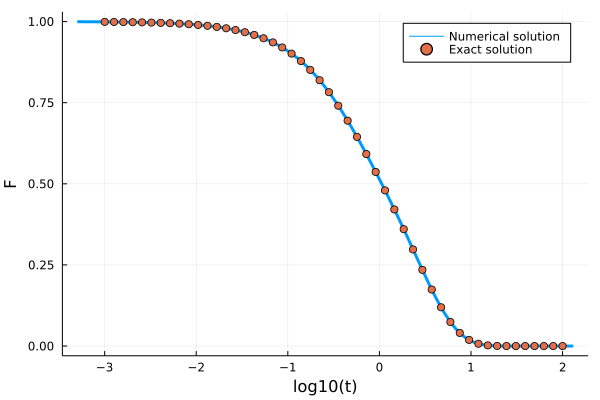

# Kernels

A memory kernel `kernel` is a callable object of which `MemoryKernel` is a supertype. It can be called like `out = kernel(F, t)`. Additionally, when `F` is a mutable container like a `Vector`, it can be called like `kernel(out, F, t)` in which case it will mutate the elements of the temporary array `out`. Below we list the memory kernels that this package defines and give some examples of how to use them.

## Schematic Kernels

This package includes a couple of schematic memory kernels.

### 1. `ExponentiallyDecayingKernel`

The `ExponentiallyDecayingKernel` implements the kernel $K(t) = λ \exp(-t/τ)$. It has fields `λ <: Number` and `τ <: Number`.

#### Example

The integro-differential equation with this memory kernel actually has an analytic solution for $\tau=1$, $\alpha=0$ , $\beta=1$, and $\gamma=1$. It is given by

$$F(t) = \frac{e^{-\frac{t}{2}\left( \lambda + \sqrt{\lambda(\lambda+4)} + 2\right)}}{2 \sqrt{\lambda  (\lambda +4)}}\left(\sqrt{\lambda(\lambda+4)} \left(e^{\sqrt{\lambda(\lambda+4)} t}+1\right)+\lambda  \left(e^{\sqrt{\lambda(\lambda+4)} t}-1\right)\right)$$

```julia
F0 = 1.0; ∂F0 = 0.0; α = 0.0; β = 1.0; γ = 1.0; λ = 1.0; τ = 1.0;

kernel = ExponentiallyDecayingKernel(λ, τ)
problem = MCTProblem(α, β, γ, F0, ∂F0, kernel)
solver = FuchsSolver(problem, Δt=10^-3, t_max=10.0^2, verbose=false, N = 128, tolerance=10^-10, max_iterations=10^6)
t, F, K =  solve(problem, solver, kernel)

t_analytic = 10 .^ range(-3, 2, length=50)
F_analytic = @. (exp(-0.5*(3+sqrt(5))* t_analytic)*(exp(sqrt(5)*t_analytic) * (1+sqrt(5))-1+sqrt(5)))/(2sqrt(5))

using Plots
p = plot(log10.(t), F, label="Numeric solution", lw=3)
scatter!(log10.(t_analytic), F_analytic, label="Exact solution", ylabel="F", xlabel="log10(t)")
```



### 2. `SchematicF1Kernel`

The `SchematicF1Kernel` implements the kernel $K(t) = λ F(t)$. It has one field `λ <: Number`.

#### Example

The integro-differential equation with this memory kernel also has an analytic solution for $\alpha=0$ , $\beta=1$, and $\gamma=1$. It is given by

$$F(t) =  e^{-2t}\left(I_0(2t) + I_1(2t) \right)$$

in which $I_k$ are modified Bessel functions of the first kind.
```julia
F0 = 1.0; ∂F0 = 0.0; α = 0.0; β = 1.0; γ = 1.0; λ = 1.0

kernel = SchematicF1Kernel(λ)
problem = MCTProblem(α, β, γ, F0, ∂F0, kernel)
solver = FuchsSolver(problem, Δt=10^-3, t_max=10.0^2, verbose=false, N = 100, tolerance=10^-14, max_iterations=10^6)
t, F, K1 =  solve(problem, solver, kernel)

using Plots, SpecialFunctions
t_analytic = 10 .^ range(-3, 2, length=50)
F_analytic = @. exp(-2*t_analytic)*(besseli(0, 2t_analytic) + besseli(1, 2t_analytic))
plot(log10.(t), F, label="Numerical Solution", ylabel="F", xlabel="log10(t)", lw=3)
scatter!(log10.(t_analytic), F_analytic, label="Exact Solution")
```


### 3. `SchematicF2Kernel`

The `SchematicF2Kernel` implements the kernel $K(t) = λ F(t)^2$. It has one field `λ <: Number`.

### 4. `SchematicF123Kernel`

The `SchematicF123Kernel` implements the kernel $K(t) = λ_1 F(t) + λ_2 F(t)^2 + λ_3 F(t)^3$. It has fields `λ1 <: Number`, `λ2 <: Number`, and `λ3 <: Number`.

#### Example
```julia
kernel = SchematicF123Kernel(3.0, 2.0, 1.0);
F = 2; t = 0;
kernel(F, t) # returns 22.0 = 3*2^1 + 2*2^2 + 1*2^3
```

### 5. `SchematicDiagonalKernel`

The `SchematicDiagonalKernel` implements the kernel $K_{ij}(t) = \delta_{ij} \lambda_i F_i(t)^2$. It has one field `λ` which must be either a `Vector` or an `SVector`. When called, it returns `Diagonal(λ .* F .^ 2)`, i.e., it implements a non-coupled system of `SchematicF2Kernels`.

### 6. `SchematicMatrixKernel`

The `SchematicMatrixKernel` implements the kernel $K_{ij}(t) = \sum_k \lambda_{ij} F_k(t) F_j(t)$. It has one field `λ` which must be either a `Matrix` or an `SMatrix`. 

## Mode-Coupling Theory

The mode-coupling theory equation reads

$$\ddot{F}(k,t) + \Omega(k)F(k,t) + \int_0^td\tau K(t-\tau, k)\dot{F}(k,\tau)$$

in which $\Omega(k) = k^2 k_B T/mS(k)$, and

$$K(k,t) =\frac{\rho k_BT}{16\pi^3 m} \int d\mathbf{q} V(\mathbf{k}, \mathbf{q})^2F(q, t)F(|\mathbf{k}-\mathbf{q}|,t)$$

in which the vertex $V(\textbf{k}, \textbf{q}) = (\textbf{k}\cdot\textbf{q})c(q)/k+(\textbf{k}\cdot(\textbf{k}-\textbf{q})c(|\textbf{k}-\textbf{q}|)/k$. For more details and the meaning of the symbols, see [1].

This memory kernel integral is discretised as follows:

$$\int d\textbf{q}f(q, |\textbf{k}-\textbf{q}|) =2\pi\int_0^\infty dq q^2 \int_0^\pi d\theta \sin \theta f(q, |\textbf{k}-\textbf{q}|) = \frac{2\pi}{k}\int_0^\infty dq \int_{|k-q|}^{k+q}dp pq f(q, p) = \frac{2\pi \Delta k^2}{k}\sum_{i_q=1}^{N_k} \sum_{i_p=|i_q-i_k|+1}^{i_k+i_q-1} p_iq_if(q_i, p_i).$$
 
in which $p = |\textbf{k}-\textbf{q}|$, and wave numbers $k$, $q$ and $p$ are discretized on the grid $k_i = (i_k-\frac{1}{2})\Delta k$ where $i_k = 1, 2, 3, \ldots, N_k$. The double sum is then performed for all $k$ using Bengtzelius' trick, yielding a fast $O(N_k^2)$ algorithm.

### Example 

```julia
"""
    find_analytical_C_k(k, η)
Finds the direct correlation function given by the 
analytical Percus-Yevick solution of the Ornstein-Zernike 
equation for hard spheres for a given volume fraction η.

Reference: Wertheim, M. S. "Exact solution of the Percus-Yevick integral equation 
for hard spheres." Physical Review Letters 10.8 (1963): 321.
""" 
function find_analytical_C_k(k, η)
    A = -(1 - η)^-4 *(1 + 2η)^2
    B = (1 - η)^-4*  6η*(1 + η/2)^2
    D = -(1 - η)^-4 * 1/2 * η*(1 + 2η)^2
    Cₖ = @. 4π/k^6 * 
    (
        24*D - 2*B * k^2 - (24*D - 2 * (B + 6*D) * k^2 + (A + B + D) * k^4) * cos(k)
     + k * (-24*D + (A + 2*B + 4*D) * k^2) * sin(k)
     )
    return Cₖ
end

"""
    find_analytical_S_k(k, η)
Finds the static structure factor given by the 
analytical Percus-Yevick solution of the Ornstein-Zernike 
equation for hard spheres for a given volume fraction η.
""" 
function find_analytical_S_k(k, η)
        Cₖ = find_analytical_C_k(k, η)
        ρ = 6/π * η
        Sₖ = @. 1 + ρ*Cₖ / (1 - ρ*Cₖ)
    return Sₖ
end


Nk = 100; η = 0.51591; ρ = η*6/π; kBT = 1.0; m = 1.0

kmax = 40.0; dk = kmax/Nk; k_array = dk*(collect(1:Nk) .- 0.5)
Sₖ = find_analytical_S_k(k_array, η)

∂F0 = zeros(Nk); α = 1.0; β = 0.0; γ = @. k_array^2*kBT/(m*Sₖ)

kernel = ModeCouplingKernel(ρ, kBT, m, k_array, Sₖ)
problem = MCTProblem(α, β, γ, Sₖ, ∂F0, kernel)
solver = FuchsSolver(problem, Δt=10^-5, t_max=10.0^15, verbose=false, 
                     N = 8, tolerance=10^-8)
t, F, K = @time solve(problem, solver, kernel);
    # 3.190870 seconds (377.93 k allocations: 106.456 MiB, 0.42% gc time)
p = plot(xlabel="log10(t)", ylabel="F(k,t)", ylims=(0,1))
for ik = [7, 18, 25, 39]
    plot!(p, log10.(t), F[ik, :]/Sₖ[ik], label="k = $(k_array[ik])", lw=3)
end
p
```


### References
[1] Reichman, David R., and Patrick Charbonneau. "Mode-coupling theory." Journal of Statistical Mechanics: Theory and Experiment 2005.05 (2005): P05013.

## Multi-component Mode-Coupling Theory

The multi-component mode-coupling theory equation reads

$$\ddot{F}_{\alpha\beta}(k,t) + \Omega_{\alpha\gamma}(k)F_{\gamma\beta}(k,t) + \int_0^td\tau K_{\alpha\gamma}(t-\tau, k)\dot{F}_{\gamma\beta}(k, \tau)$$

in which $\Omega_{\alpha\gamma} = k^2 k_B T x_\alpha/m_\alpha \cdot \left(S^{-1}\right)_{\alpha\beta}(k)$, and

$$K_{\alpha\beta}(k,t) =\frac{k_B T \rho}{2 x_\beta m_\alpha (2\pi)^3} \int d\mathbf{q} V_{\mu'\nu'\alpha}(\mathbf{k}, \mathbf{q})F_{\mu\mu'}(q, t)F_{\nu\nu'}(|\mathbf{k}-\mathbf{q}|,t)V_{\mu\nu\alpha}(\mathbf{k}, \mathbf{q})$$

in which the vertex $V_{\mu\nu\alpha}(\mathbf{k}, \mathbf{q}) = (\textbf{k}\cdot\textbf{q})c_{\alpha\mu}(q)\delta_{\alpha\nu}/k+(\textbf{k}\cdot(\textbf{k}-\textbf{q})c_{\alpha\nu}(|\textbf{k}-\textbf{q}|)\delta_{\alpha\mu}/k$. Here, the Greek indices indicate species labels, and we have adopted the convention that we sum over repeated indices. This memory kernel has also been implemented using the Bengtzelius trick. It requires $O(N_k^2 N_s^2)$ storage and runs in $O(N_k^2 N_s^4)$ in which $N_s$ is the number of species.

Numerically, the correlator $F_{\alpha\beta}(k)$ is implemented as a `Vector` of length `Nk` of which each of the elements is a small `Ns` x `Ns` static matrix. 

### Example

```julia
using StaticArrays, LinearAlgebra, DelimitedFiles
Ns = 2; Nk = 100; ϕ  = 0.515; kBT = 1.0; m = ones(Ns)
particle_diameters = [0.8,1.0]
concentration_ratio = [0.2,0.8]
ρ_all = 6ϕ/(π*sum(concentration_ratio .* particle_diameters .^3))
ρ = ρ_all * concentration_ratio
x = ρ/sum(ρ)

kmax = 40.0; dk = kmax/Nk
k_array = dk*(collect(1:Nk) .- 0.5)

# data can be found in the \test\ folder of the source code
Sₖdata = reshape(readdlm("Sk_MC.txt"), (2,2,100))
Sₖ = [@SMatrix(zeros(Ns, Ns)) for i = 1:Nk]
for i = 1:Nk
    Sₖ[i] = Sₖdata[:, :, i]
end
S⁻¹ = inv.(Sₖ)

J = similar(Sₖ) .* 0.0
for ik = 1:Nk
    J[ik] = kBT*k_array[ik]^2 * x ./ m .* I(Ns)
end

F₀ = copy(Sₖ)
∂ₜF₀ = [@SMatrix(zeros(Ns, Ns)) for i = 1:Nk]
α = 0.0
β = 1.0
γ = similar(Sₖ)
γ .*= 0.0
for ik = 1:Nk
    γ .= J.*S⁻¹
end

kernel = MultiComponentModeCouplingKernel(ρ, kBT, m, k_array, Sₖ)
problem = MCTProblem(α, β, γ, F₀, ∂ₜF₀, kernel)
solver = FuchsSolver(problem, verbose=false, N=2, tolerance=10^-8, max_iterations=10^8)
solve(problem, solver, kernel)
t, F, K = solve(problem, solver, kernel)
ik = 19
p = plot(log10.(t), getindex.(F[ik,:], 1,1)/Sₖ[ik][1,1], ls=:dash, lw=2, color=1, label="Faa") 
plot!(log10.(t), getindex.(F[ik,:], 1,2)/Sₖ[ik][1,2], lw=2, color=2, label="Fab") 
plot!(log10.(t), getindex.(F[ik,:], 2,1)/Sₖ[ik][2,1], ls=:dash, lw=2, color=3, label="Fba") 
plot!(log10.(t), getindex.(F[ik,:], 2,2)/Sₖ[ik][2,2], ls=:dash, lw=2, color=4, label="Fbb")
```


## Defining custom kernels

