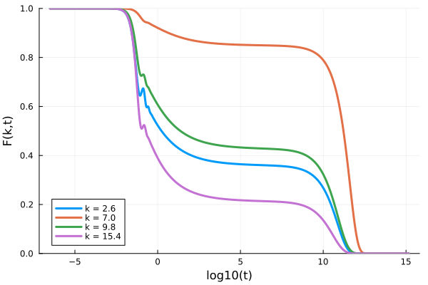

## Single-component Mode-Coupling Theory

The mode-coupling theory equation reads

$$\ddot{F}(k,t) + \Omega(k)F(k,t) + \int_0^td\tau K(t-\tau, k)\dot{F}(k,\tau)=0$$

in which $\Omega(k) = k^2 k_B T/mS(k)$, and

$$K(k,t) =\frac{\rho k_BT}{16\pi^3 m} \int d\mathbf{q} V(\mathbf{k}, \mathbf{q})^2F(q, t)F(|\mathbf{k}-\mathbf{q}|,t)$$

in which the vertex $V(\textbf{k}, \textbf{q}) = (\textbf{k}\cdot\textbf{q})c(q)/k+(\textbf{k}\cdot(\textbf{k}-\textbf{q})c(|\textbf{k}-\textbf{q}|)/k$. For more details and the meaning of the symbols, see [1, 2].

This memory kernel integral is discretized as follows:

$$\int d\textbf{q}f(q, |\textbf{k}-\textbf{q}|) = 2\pi\int_0^\infty dq q^2 \int_0^\pi d\theta \sin \theta f(q, |\textbf{k}-\textbf{q}|) = \frac{2\pi}{k}\int_0^\infty dq \int_{|k-q|}^{k+q}dp pq f(q, p) \approx \frac{2\pi \Delta k^2}{k_i}\sum_{j=1}^{N_k} \sum_{l=|j-i|+1}^{j+i-1} \frac{p_l q_j}{k_i}f(q_j, p_l).$$
 
in which $p = |\textbf{k}-\textbf{q}|$, and wave numbers $k$, $q$ and $p$ are discretized on the equidistant grid $k_i = (i_k-\frac{1}{2})\Delta k$ where $i_k = 1, 2, 3, \ldots, N_k$. The double sum is then performed for all $k$ using Bengtzelius' trick, yielding a fast $O(N_k^2)$ algorithm. 

### Example 

```julia
"""
    find_analytical_C_k(k, η)
Finds the direct correlation function given by the 
analytical Percus-Yevick solution of the Ornstein-Zernike 
equation for hard spheres for a given volume fraction η.

Reference: Wertheim, M. S. "Exact solution of the Percus-Yevick integral equation 
for hard spheres." Physical Review Letters 10.8 (1963): 321.
""" 
function find_analytical_C_k(k, η)
    A = -(1 - η)^-4 *(1 + 2η)^2
    B = (1 - η)^-4*  6η*(1 + η/2)^2
    D = -(1 - η)^-4 * 1/2 * η*(1 + 2η)^2
    Cₖ = @. 4π/k^6 * 
    (
        24*D - 2*B * k^2 - (24*D - 2 * (B + 6*D) * k^2 + (A + B + D) * k^4) * cos(k)
     + k * (-24*D + (A + 2*B + 4*D) * k^2) * sin(k)
     )
    return Cₖ
end

"""
    find_analytical_S_k(k, η)
Finds the static structure factor given by the 
analytical Percus-Yevick solution of the Ornstein-Zernike 
equation for hard spheres for a given volume fraction η.
""" 
function find_analytical_S_k(k, η)
        Cₖ = find_analytical_C_k(k, η)
        ρ = 6/π * η
        Sₖ = @. 1 + ρ*Cₖ / (1 - ρ*Cₖ)
    return Sₖ
end

# We solve MCT for hard spheres at a volume fraction of 0.51591
η = 0.51591; ρ = η*6/π; kBT = 1.0; m = 1.0

Nk = 100; kmax = 40.0; 
dk = kmax/Nk; k_array = dk*(collect(1:Nk) .- 0.5) # construct the grid this way to satisfy the assumptions
                                                  # of the discretization.
Sₖ = find_analytical_S_k(k_array, η)

∂F0 = zeros(Nk); α = 1.0; β = 0.0; γ = @. k_array^2*kBT/(m*Sₖ); δ = 0.0

kernel = ModeCouplingKernel(ρ, kBT, m, k_array, Sₖ)
problem = MemoryEquation(α, β, γ, δ, Sₖ, ∂F0, kernel)
solver = TimeDoublingSolver(Δt=10^-5, t_max=10.0^15, verbose=true, 
                     N = 8, tolerance=10^-8)
sol = solve(problem, solver);
p = plot(xlabel="log10(t)", ylabel="F(k,t)", ylims=(0,1))
for ik = [7, 18, 25, 39]
    Fk = get_F(sol, :, ik)
    plot!(p, log10.(get_t(sol)), Fk/Sₖ[ik], label="k = $(k_array[ik])", lw=3)
end
p
```



#### References
[1] Reichman, David R., and Patrick Charbonneau. "Mode-coupling theory." Journal of Statistical Mechanics: Theory and Experiment 2005.05 (2005): P05013.

[2] Janssen, Liesbeth MC. "Mode-coupling theory of the glass transition: A primer." Frontiers in Physics 6 (2018): 97.

## TaggedModeCouplingKernel

Let's say we have just solved the mode-coupling equations, and we now want to include also a tagged particle solution (to find the self-intermediate scattering function). This function satisfies

$$\ddot{F}_s(k,t) + \frac{k^2 k_BT}{m} F_s(k,t) + \int_0^t d\tau K(k, t-\tau)\dot{F}_s(k, \tau)=0,$$

in which

$$K(k,t) = \frac{\rho k_BT}{8\pi^3 m}\int d\mathbf{q} V(\mathbf{k}, \mathbf{q})^2 F(q, t)F_s(|\mathbf{k}-\mathbf{q}|,t)$$
 
where

$V(\textbf{k}, \textbf{q}) = (\textbf{k}\cdot\textbf{q})c(q)/k = \frac{k^2+q^2-p^2}{2k} \cdot c(q),$
are the tagged vertices. This is done using the `TaggedModeCouplingKernel`.

Example (excluding the code from collective MCT):
```julia
taggedF0 = ones(Nk); tagged∂F0 = zeros(Nk); α = 1.0; β = 0.0; γ = @. k_array^2*kBT/m; δ = 0.0

taggedkernel = TaggedModeCouplingKernel(ρ, kBT, m, k_array, Sₖ, sol)
taggedequation = MemoryEquation(α, β, γ, δ, taggedF0, tagged∂F0, taggedkernel)
taggedsol = solve(taggedequation, solver)
```

### Mean squared displacement (MSD)

From the tagged particle dynamics we just computed, we can evaluate the MSD, as a low k limit. The equations that it satisfies are

$$\ddot{\delta r^2}(t) - \frac{6 k_BT}{m}  + \int_0^t d\tau K(k, t-\tau)\delta\dot{ r}^2(\tau)=0,$$

where

$$K(t) = \frac{\rho k_BT}{6\pi^2 m}\int_0^\infty dq q^4c(q)^2F(q,t)F_s(q,t).$$
This kernel is implemented in the `MSDModeCouplingKernel`

Example:

```julia
MSD0 = 0.0; dMSD0 = 0.0; α = 1.0; β = 0.0; γ = 0.0; δ = -6.0*kBT/m;
msdkernel = MSDModeCouplingKernel(ρ, kBT, m, k_array, Sₖ, sol, taggedsol)
msdequation = MemoryEquation(α, β, γ, δ, MSD0, dMSD0, msdkernel)
msdsol = solve(msdequation, solver)

plot(log10.(msdsol.t), log10.(msdsol.F), xlabel="log(t)", ylabel="log(MSD(t))", xlims=(-5,15), label=false)
```


## Multi-component Mode-Coupling Theory

The multi-component mode-coupling theory equation reads

$$\ddot{F}_{\alpha\beta}(k,t) + \Omega^2_{\alpha\gamma}(k)F_{\gamma\beta}(k,t) + \int_0^td\tau K_{\alpha\gamma}(t-\tau, k)\dot{F}_{\gamma\beta}(k, \tau)=0$$

in which $\Omega^2_{\alpha\gamma} = k^2 k_B T x_\alpha/m_\alpha \cdot \left(S^{-1}\right)_{\alpha\gamma}(k)$, and $(\textbf{S})^{-1}(k) = (\frac{\delta_{\alpha\beta}}{x_\alpha} - \rho c_{\alpha\gamma}(k))$. The memory kernel is given by

$$K_{\alpha\beta}(k,t) =\frac{k_B T \rho}{2 x_\beta m_\alpha (2\pi)^3} \int d\mathbf{q} V_{\mu'\nu'\alpha}(\mathbf{k}, \mathbf{q})F_{\mu\mu'}(q, t)F_{\nu\nu'}(|\mathbf{k}-\mathbf{q}|,t)V_{\mu\nu\beta}(\mathbf{k}, \mathbf{q})$$

in which the vertex $V_{\mu\nu\alpha}(\mathbf{k}, \mathbf{q}) = (\textbf{k}\cdot\textbf{q})c_{\alpha\mu}(q)\delta_{\alpha\nu}/k+(\textbf{k}\cdot(\textbf{k}-\textbf{q})c_{\alpha\nu}(|\textbf{k}-\textbf{q}|)\delta_{\alpha\mu}/k$. Here, the Greek indices indicate species labels, and we have adopted the convention that we sum over repeated indices. This memory kernel has also been implemented using the Bengtzelius trick. It requires $O(N_k^2 N_s^2)$ storage and runs in $O(N_k^2 N_s^4)$ in which $N_s$ is the number of species.

Numerically, the correlator $F_{\alpha\beta}(k)$ is implemented as a `Vector` of length `Nk` of which each of the elements is a small `Ns` x `Ns` static matrix. This means that this is also the expected form of the initial condition. If, instead you have the data in a matrix format where each element of the matrix is a list of k-values, use the `convert_multicomponent_structure_factor(S)` function to convert it into the right format, see the API page. 

All symbols have the same meaning as those presented in "Weysser, F., Puertas, A. M., Fuchs, M., & Voigtmann, T. (2010). Structural relaxation of polydisperse hard spheres: Comparison of the mode-coupling theory to a Langevin dynamics simulation. Physical review E, 82(1), 011504."

### Example

```julia
using StaticArrays, LinearAlgebra, DelimitedFiles
# number of species Ns, number of wave numbers Nk, volume fraction η
# thermal energy kBT and mass m
Ns = 2; Nk = 100; η  = 0.515; kBT = 1.0; m = ones(Ns)
particle_diameters = [0.8,1.0]
x = [0.2,0.8] # species fraction

# total density
ρ_all = 6η/(π*sum(x .* particle_diameters .^ 3))
ρ = ρ_all * x

kmax = 40.0; dk = kmax/Nk
k_array = dk*(collect(1:Nk) .- 0.5)

# data can be found in the \test\ folder of the source code
Sₖdata = reshape(readdlm("test/Sk_MC.txt"), (2,2,100))
# convert the data to the Vector of SMatrix format
Sₖ = [@SMatrix(zeros(Ns, Ns)) for i = 1:Nk]
for i = 1:Nk
    Sₖ[i] = Sₖdata[:, :, i]
end
S⁻¹ = inv.(Sₖ)

J = similar(Sₖ) .* 0.0
for ik = 1:Nk
    J[ik] = kBT*k_array[ik]^2 * x ./ m .* I(Ns)
end

F₀ = copy(Sₖ)
∂ₜF₀ = [@SMatrix(zeros(Ns, Ns)) for i = 1:Nk]
α = 1.0
β = 0.0
Ω2 = similar(Sₖ)
for ik = 1:Nk
    Ω2 .= J.*S⁻¹
end
δ = @SMatrix zeros(Ns, Ns)

kernel = MultiComponentModeCouplingKernel(ρ, kBT, m, k_array, Sₖ)
problem = MemoryEquation(α, β, Ω2, δ, F₀, ∂ₜF₀, kernel)
solver = TimeDoublingSolver(verbose=false, N=16, tolerance=10^-8, max_iterations=10^8)
sol = solve(problem, solver)
ik = 19
k = k_array[ik]
t = get_t(sol)

Fk_11 = get_F(sol, :, ik, (1,1))
Fk_12 = get_F(sol, :, ik, (1,2))
Fk_21 = get_F(sol, :, ik, (2,1))
Fk_22 = get_F(sol, :, ik, (2,2))

p = plot(log10.(t), Fk_11/Sₖ[ik][1,1], ls=:dash, lw=2, color=1, label="Faa(k=$k, t)") 
plot!(log10.(t), Fk_12/Sₖ[ik][1,2], lw=2, color=2, label="Fab(k=$k, t)") 
plot!(log10.(t), Fk_21/Sₖ[ik][2,1], ls=:dash, lw=2, color=3, label="Fba(k=$k, t)") 
plot!(log10.(t), Fk_22/Sₖ[ik][2,2], ls=:dash, lw=2, color=4, label="Fbb(k=$k, t)")
```


### Tagged multi-component mode-coupling theory

The tagged multi-component mode-coupling theory equation reads

$$\dot{F}_{s}(k,t) + \Omega_s^2(k)F_{s}(k,t) + \int_0^td\tau K_{s}(t-\tau, k)\dot{F}_{s}(k, \tau)=0$$
 
for a particle of species $s$ in which $\Omega_{s}^2 = k^2 k_B T/m_s$. The memory kernel is given by

$$K_{s}(k,t) =\frac{k_B T \rho}{k^3m_s (2\pi)^3} \sum_{\alpha\beta}\int d\mathbf{q} \left(\textbf{k}\cdot\textbf{q}\right)^2C_{s\alpha}(q)C_{s\beta}(q)F_{\alpha\beta}(q, t)F_{s}(|\mathbf{k}-\mathbf{q}|,t).$$ Here $F_{s}$ is the tagged correlator, with initial condition $F_{s}(t=0)=1$, and $F_{\alpha\beta}$ is the collective correlator which can be obtained as explained in the previous section.

#### Example
```julia 
# we look for the tagged correlator of the second species.
s = 2
α = 1.0
β = 0.0
γ = [kBT * k_array[ik]^2 ./ m[s] for ik = 1:Nk]
δ = 0.0
F0 = [1.0 for ik = 1:Nk]
dF0 = [0.0 for ik = 1:Nk]

taggedkernel = TaggedMultiComponentModeCouplingKernel(s, ρ, kBT, m, k_array, Sₖ, sol);
taggedequation = MemoryEquation(α, β, γ, δ, F0, dF0, taggedkernel);
taggedsol = solve(taggedequation, solver)
```
In order to solve the tagged particle equation for all species, one should loop over the above code, changing species index $s$ from 1 to the number of species.

### Multi-component mean-squared displacements

The equation for the mean squared displacement in a multicomponent system reads

$$\delta \dot{r}_s^2(t) -\frac{6k_BT}{m_s} + \int_0^td\tau K_{s}(t-\tau)\delta \dot{r}_s^2(\tau)=0$$
 
for a particle of species $s$. The memory kernel is given by

$$K_s(t) = \frac{\rho k_BT}{6\pi^2 m_s}\sum_{\alpha\beta}\int_0^\infty dq q^4c_{s\alpha}(q)c_{s\beta}(q)F_{\alpha\beta}(q,t)F^{(s)}_s(q,t).$$

Here $\delta r_s^2(t)$ is the MSD of species s, with initial condition $\delta r_s^2(t=0)=0$, and $\delta \dot{r}_s^2(t=0)=0$. This kernel is implemented using the `MSDMultiComponentModeCouplingKernel`

#### Example
```julia 
# we look for the tagged correlator of the second species.
s = 2
α = 1.0
β = 0.0
γ = 0.0
δ = -6*kBT / m[s]
msd0 = 0.0
dmsd0 = 0.0

msdkernel = MSDMultiComponentModeCouplingKernel(s, ρ, kBT, m, k_array, Sₖ, sol, taggedsol);
msdequation = MemoryEquation(α, β, γ, δ, msd0, dmsd0, msdkernel);
msdsol = solve(msdequation, solver)
```

## Bengtzelius' Trick

Bengtzelius' trick is a fast way to evaluate the integral $I(k) = \int d \mathbf{q} A(q, |\mathbf{k}-\mathbf{q}|)$. It is used in the evaluation of all memory kernels listed on this page. Very briefly: after discretization of the integral, one is left with terms such as $T_{i}[A]=\sum_{j=1}^{N_k}\sum_{l=|j-i|+1}^{i+j-1}  A(p_{l},q_{j})$ which are largely independent of $i$. Because of this, one can calculate $T_{i}[A]$ from $T_{i-1}[A]$ in order $N_k$ operations. Writing $A_{l,j} = A(l\Delta k, j\Delta k)$, the recurrence relation that allows one to do so is given by 

$$T_{i}[A] = T_{i-1}[A] + \sum_{j=1}^{N_k-i+1}(A_{j, j+i-1}+A_{j+i-1, j}) - \sum_{j=1}^{i-1}A_{j,i-j}$$

with initial condition

$$T_{1}[A] = \sum_{j=1}^{N_k}A_{j, j}.$$

## Other dimensions

The equations presented above for $F(k,t),\ F_s(k,t)$ and $\delta r^2(t)$ have also been implemented for $d$-dimensional Euclidean space. By default, the solver will assume that we are working in $d=3$. To change this, one should simply modify the keyword argument `dims` when calling the appropriate kernel. For instance:

```julia 
kernel_MCT = ModeCouplingKernel(ρ, kBT, m, k_array, Sₖ ; dims=5)
kernel_tagged_MCT = TaggedModeCouplingKernel(ρ, kBT, m, k_array, Sₖ, sol; dims=5)
kernel_MSD_MCT = MSDModeCouplingKernel(ρ, kBT, m, k_array, Sₖ, sol, taggedsol; dims=5)
```
Note that this code is not written or tested for spatial dimensions higher than $d \gtrapprox 20$. 
