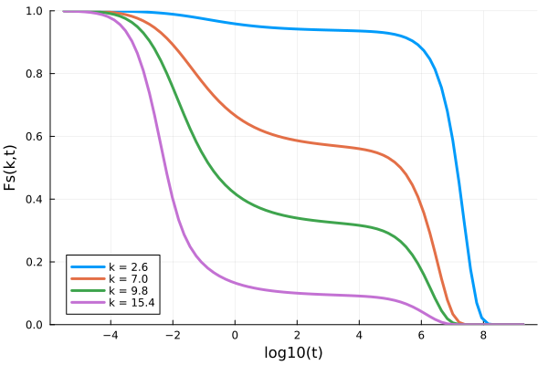

## Self-consistent Generalized Langevin Equation Theory

The differential equation to solve is

$$ \frac{\partial F}{\partial t} + \frac{k^2D_0}{S(k)}F(k,t) + \lambda(k)\int_0^t dt' \Delta\zeta(t-t')\frac{\partial F}{\partial t'} = 0$$

In this case, $\alpha=0$, $\beta=1.0$, $\gamma=k^2D_0/S(k)$, $\delta=0.0$ and $K(k,t) = \lambda(k)\Delta\zeta(t)$. In the context of the SCGLE theory, $\Delta\zeta(t)$ is defined as

$$\Delta \zeta(t) = \frac{k_BT}{144\pi^2\varphi} \int d\textbf{q} M^2(q) F_s(q,t) F(q,t),$$

where $M(k) = k \frac{S(k)-1}{S(k)}$, and $\varphi$ is the volume fraction.

This means we need to solve a time integral of the form of the first equation for the collective part, coupled with a similar equation for the self component. To do this, we create a long array of the form

$$ F(t) = [f_s(t) , f(t)]=[f_s[1], f_s[2], ..., f_s[Nk], f[1], f[2], ..., f[Nk]]$$

and thus the coefficient $\gamma$ for $D_0=1.0$ becomes

$$\gamma = [k_i^2, k_i^2/S(k_i)].$$

Analogously, the $\lambda(k)$ array is

$$ \lambda = [\lambda_s(k_i), \lambda_c(k_i)],$$

where 

$$\lambda_s = \lambda_c = \frac{1}{1+(k/k_c)^2}$$
with $k_c/2\pi=1.302$. 

The following example shows how to solve these equations with `ModeCouplingTheory.jl`:
```julia
using ModeCouplingTheory, Plots

# defining the structure factor
function find_analytical_C_k(k, η)
    A = -(1 - η)^-4 *(1 + 2η)^2
    B = (1 - η)^-4*  6η*(1 + η/2)^2
    D = -(1 - η)^-4 * 1/2 * η*(1 + 2η)^2
    Cₖ = @. 4π/k^6 * 
    (
        24*D - 2*B * k^2 - (24*D - 2 * (B + 6*D) * k^2 + (A + B + D) * k^4) * cos(k)
     + k * (-24*D + (A + 2*B + 4*D) * k^2) * sin(k)
     )
    return Cₖ
end

function find_analytical_S_k(k, η)
        Cₖ = find_analytical_C_k(k, η)
        ρ = 6/π * η
        Sₖ = @. 1 + ρ*Cₖ / (1 - ρ*Cₖ)
    return Sₖ
end

# Appling the Verlet-Weiss correction
# [1] Loup Verlet and Jean-Jacques Weis. Phys. Rev. A 5, 939 – Published 1 February 1972
ϕ_VW(ϕ :: Float64) = ϕ*(1.0 - (ϕ / 16.0))
k_VW(ϕ :: Float64, k :: Float64) = k*((ϕ_VW(ϕ)/ϕ)^(1.0/3.0))

# initial setup
Nk = 100
kmax = 40.0; dk = kmax/Nk
k = dk*(collect(1:Nk) .- 0.5)
# volume factor
ϕ = 0.581

# Structure factor
s = ones(length(k))
S = find_analytical_S_k(k_VW.(ϕ, k), ϕ_VW(ϕ))
# update the long arrays
k = [k; k]
S = [s; S]

∂F0 = zeros(2*Nk); α = 0.0; β = 1.0; γ = @. k^2/S; δ = 0.0

kernel = SCGLEKernel(ϕ, k, S)
equation = MemoryEquation(α, β, γ, δ, S, ∂F0, kernel)
solver = TimeDoublingSolver(Δt=10^-5, t_max=10.0^10, 
    N = 8, tolerance=10^-8, verbose=true)
sol = @time solve(equation, solver)

using Plots
p = plot(xlabel="log10(t)", ylabel="Fs(k,t)", ylims=(0,1))
for ik = [7, 18, 25, 39]
    Fk = get_F(sol, 1:10:800, ik)
    t = get_t(sol)[1:10:800]
    plot!(p, log10.(t), Fk/S[ik], label="k = $(k[ik])", lw=3)
end
p
```



Reference:
1. Yeomans-Reyna, Laura, and Magdaleno Medina-Noyola. "Self-consistent generalized Langevin equation for colloid dynamics." Physical Review E 64.6 (2001): 066114.