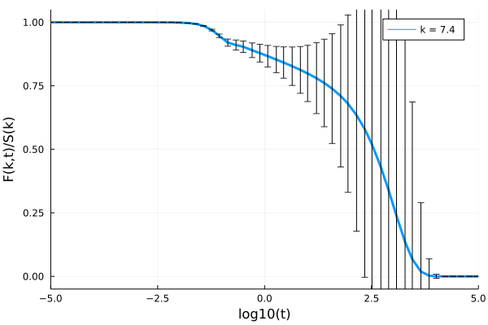
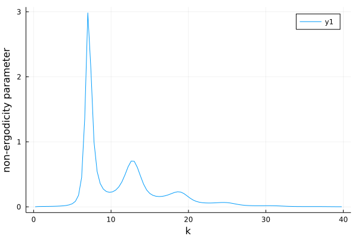

## Automatic differentiation

This package is compatible with forward-mode automatic differentiation. This makes it possible to calculate quatities such as $\frac{dF(t)}{d\lambda}$ for example, where $\lambda$ is a parameter of the memory kernel.

### Example

Let's take the derivative of the solution to the generalized Langevin equation with the exponentially decaying kernel with respect to the coupling parameter. First we need to write a function that solves this equation and outputs the solution for a given coupling parameter. Since we know the analytical solution, we can compare with the derivative of that.

```julia
using ModeCouplingTheory, Plots
function my_func(λ)
    F0 = 1.0
    ∂F0 = 0.0
    α = 0.0
    β = 1.0
    γ = 1.0

    kernel = ExponentiallyDecayingKernel(λ, 1.0)
    problem = LinearMCTEquation(α, β, γ, F0, ∂F0, kernel)
    solver = FuchsSolver(Δt=10^-4, t_max=5*10.0^1, verbose=false, N = 128, tolerance=10^-10, max_iterations=10^6)

    sol =  solve(problem, solver)
    return [sol.t[2:end], sol.F[2:end], sol.K[2:end]]
end

function exact_func(λ, t)
    temp = sqrt(λ*(λ+4)) 
    F = @. exp(-0.5* t*(temp+λ+2)) * (temp*(exp(temp*t)+1)+ λ* (exp(temp*t)-1)) / (2temp) 
    return [t, F]
end

sol = my_func(5.0)
texact, Fexact = exact_func(5.0, t)

p = plot(log10.(texact), Fexact, label="Exact", lw=4) 
scatter!(log10.(sol.t[1:100:end]), sol.F[1:100:end], label="Numerical solution", ls=:dash, lw=4) 
```


Now we can take the derivative with respect to the argument of the functions we defined:

```julia
using ForwardDiff
_, dF_exact = ForwardDiff.derivative(y -> exact_func(y, t), 5.0)
sol = ForwardDiff.derivative(my_func, 5.0)

p = plot(log10.(texact), dF_exact, lw=3, label="Exact", ylabel="dF/dλ(λ=5,t)", xlabel="log10(t)") 
plot!(log10.(sol.t), sol.dF, ls=:dash, lw=3, label="Numerical solution", legend=:topleft)
```


## Measurement errors and other number types

Similar to automatically evaluating derivatives, it is also possible to automatically propagate measurement errors through the entire solution process. This does however cause a serious performace loss. It works by instead of doing arithmatic with standard floating point numbers, it uses numbers with an error attached. The 
[Measurements.jl](https://juliaphysics.github.io/Measurements.jl/stable/) package implements how arithmatic with such numbers should be performed. Analagously, one can use arbitrary precision arithmatic (when many decimal places of precision are required) or complex valued numbers together with this package.

### Example

Let's solve standard mode-coupling theory with a structure factor that contains measurement errors. To generate such a structure factor, we can use the analytical Percus-Yevick expression, but pretend there is an uncertainty in the volume fraction $\eta$.

```julia

julia> using ModeCouplingTheory, Plots, Measurements

julia> η = 0.51 ± 0.01
0.51 ± 0.05

julia> ρ = η*6/π
0.974 ± 0.019

julia> kBT = 1.0; m = 1.0;

julia> Nk = 100; kmax = 40.0; dk = kmax/Nk; k_array = dk*(collect(1:Nk) .- 0.5);
```

We use the same functions to find the structure factor as before:

```
"""
Finds the fourier transform of the direct correlation function given by the 
analytical percus yevick solution of the Ornstein Zernike 
equation for hard spheres for a given volume fraction η on the coordinates r
in units of one over the diameter of the particles
""" 
function find_analytical_C_k(k, η)
    A = -(1 - η)^-4 *(1 + 2η)^2
    B = (1 - η)^-4*  6η*(1 + η/2)^2
    D = -(1 - η)^-4 * 1/2 * η*(1 + 2η)^2
    Cₖ = @. 4π/k^6 * 
    (
        24*D - 2*B * k^2 - (24*D - 2 * (B + 6*D) * k^2 + (A + B + D) * k^4) * cos(k)
     + k * (-24*D + (A + 2*B + 4*D) * k^2) * sin(k)
     )
    return Cₖ
end

"""
Finds the static structure factor given by the 
analytical percus yevick solution of the Ornstein Zernike 
equation for hard spheres for a given volume fraction η on the coordinates r
in units of one over the diameter of the particles
""" 
function find_analytical_S_k(k, η)
        Cₖ = find_analytical_C_k(k, η)
        ρ = 6/π * η
        Sₖ = @. 1 + ρ*Cₖ / (1 - ρ*Cₖ)
    return Sₖ
end

julia> Sₖ_uncertain = find_analytical_S_k(k_array, ρ*π/6)
100-element Vector{Measurement{Float64}}:
  0.0142 ± 0.0014
  0.0145 ± 0.0015
  0.0152 ± 0.0015
  0.0163 ± 0.0017
         ⋮
  1.0154 ± 0.0012
  0.9987 ± 0.00012
 0.98327 ± 0.00089

julia> plot(k_array, Sₖ_uncertain, xlabel="k", ylabel="S(k)", legend=false)
```


Now we can use this structure factor to solve the mode-coupling equation as usual.

```julia
# The initial condition of the derivative must have the same type as the initial condition itself
∂F0 = zeros(eltype(Sₖ_uncertain), Nk)
α = 1.0; β = 0.0; γ = @. k_array^2*kBT/(m*Sₖ_uncertain)
kernel = ModeCouplingKernel(ρ, kBT, m, k_array, Sₖ_uncertain)
problem = LinearMCTEquation(α, β, γ, Sₖ_uncertain, ∂F0, kernel)
solver = FuchsSolver(Δt=10^-5, t_max=10.0^5, verbose=true, N = 8, tolerance=10^-8, max_iterations=10^8)
sol = @time solve(problem, solver);
p = plot(xlabel="log10(t)", ylabel="F(k,t)", ylims=(0,1), xlims=(-5,5))
plot!(p, log10.(sol.t[2:10:end]), sol[19]/Sₖ_uncertain[19], label="k = $(k_array[19])", lw=3)
```



## Steady state (non-ergodicity parameter)

This package also exports a function `solve_steady_state(γ, F₀, kernel; tolerance=10^-8, max_iterations=10^6, verbose=false)` to find the steady-state solution of a mode-coupling like equation. In order to find it, it performs a recursive iteration of the mapping 

$$F^\infty = (K(F^\infty,t=\infty) + γ)^{-1} \cdot K(F^\infty, t=\infty) \cdot F(t=0)$$


### Example

```julia
using ModeCouplingTheory, Plots
η = 0.51595; ρ = η*6/π; kBT = 1.0; m = 1.0
Nk = 100; kmax = 40.0; dk = kmax/Nk; k_array = dk*(collect(1:Nk) .- 0.5);
Sₖ = find_analytical_S_k(k_array, ρ*π/6)

γ = @. k_array^2*kBT/(m*Sₖ)
kernel = ModeCouplingKernel(ρ, kBT, m, k_array, Sₖ)
fk = solve_steady_state(γ, Sₖ, kernel; tolerance=10^-8, verbose=false)
p = plot(k_array, fk, ylabel="non-ergodicity parameter", xlabel="k")
```




## Relaxation time

Relaxation times can be easily extracted from dynamical data using the `find_relaxation_time(t, F; threshold=exp(-1), mode=:log)` function.

### Example
Let's solve mode-coupling theory to get some data:
```julia
# We solve MCT for hard spheres at a volume fraction of 0.51591
η = 0.51591; ρ = η*6/π; kBT = 1.0; m = 1.0

Nk = 100; kmax = 40.0; dk = kmax/Nk; k_array = dk*(collect(1:Nk) .- 0.5)
Sₖ = find_analytical_S_k(k_array, η)

∂F0 = zeros(Nk); α = 1.0; β = 0.0; γ = @. k_array^2*kBT/(m*Sₖ)

kernel = ModeCouplingKernel(ρ, kBT, m, k_array, Sₖ)
problem = LinearMCTEquation(α, β, γ, Sₖ, ∂F0, kernel)
solver = FuchsSolver(Δt=10^-5, t_max=10.0^15, verbose=false, 
                     N = 8, tolerance=10^-8)
sol = @time solve(problem, solver);
```

We can now extract a single relaxation time by calling 

```julia
julia> find_relaxation_time(sol.t, sol[18]) # at k k_array[18]
4.232796654132995e11
```
To extract all relaxation times as a function of $k$:
```julia
julia> t_R = [find_relaxation_time(t, F[ik, :]) for ik in eachindex(k_array)]; 
julia> p = plot(k_array, log10.(t_R), xlabel="k", ylabel="log10(relaxation time)", legend=false)
```


