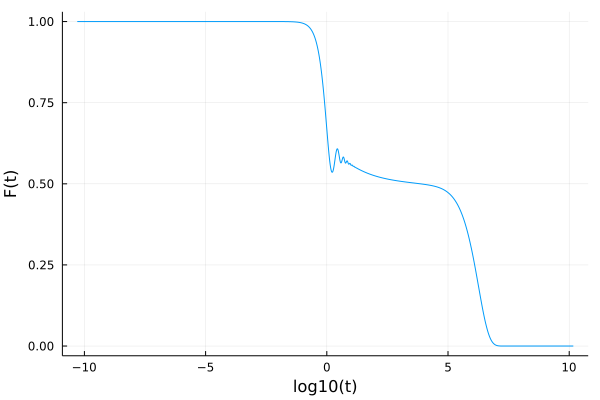

# ModeCouplingTheory.jl

This package provides a generic and fast solver of mode-coupling theory-like integrodifferential equations. It uses the algorithm outlined in [Fuchs et al.](https://iopscience.iop.org/article/10.1088/0953-8984/3/26/022/meta) to solve equations of the form

$$\alpha \ddot{F}(t) + \beta \dot{F}(t) + \gamma F(t) + \delta + \int_0^t d\tau K(t-\tau)\dot{F}(\tau) = 0$$

in which $\alpha$, $\beta$, $\gamma$, and $\delta$ are coefficients, and $K(t) = K(F(t), t)$. This package exports some commonly used memory kernels, but it is straightforward to define your own. The solver is differentiable and works for scalar- and vector-valued functions $F(t)$. 

# Installation

To install the package run:

```julia
import Pkg
Pkg.add("ModeCouplingTheory")
```

# Example

We can define one of the predefined memory kernels 

```julia
julia> using ModeCouplingTheory
julia> ν = 3.999
3.999
julia> kernel = SchematicF2Kernel(ν)
SchematicF2Kernel{Float64}(3.999)
```
This kernel evaluates $K(t)=\nu F(t)^2$.

We can now define the equation we want to solve as follows:

```
julia> α = 1.0; β = 0.0; γ = 1.0; δ = 0.0; F0 = 1.0; ∂F0 = 0.0;
julia> equation = MemoryEquation(α, β, γ, δ, F0, ∂F0, kernel)
Linear MCT equation object:
   α F̈ + β Ḟ + γF + δ + ∫K(τ)Ḟ(t-τ) = 0
in which α is a Float64,
         β is a Float64,
         γ is a Float64,
         δ is a Float64,
  and K(t) is a SchematicF2Kernel{Float64}.
```
and jula solver:

```julia
julia> solver = TimeDoublingSolver()
```

Now we can solve the equation by calling `solve`:

```julia
julia> using Plots
julia> sol = solve(equation, solver);
julia> t = get_t(sol)
julia> F = get_F(sol)
julia> plot(log10.(t), F)
```


Full copy-pastable example:

```
using ModeCouplingTheory, Plots
ν = 3.999
α = 1.0; β = 0.0; γ = 1.0; δ = 0.0; F0 = 1.0; ∂F0 = 0.0;
kernel = SchematicF2Kernel(ν)
problem = MemoryEquation(α, β, γ, δ, F0, ∂F0, kernel)
solver = TimeDoublingSolver()
sol = solve(problem, solver);
t = get_t(sol)
F = get_F(sol)
plot(log10.(t), F)
```

